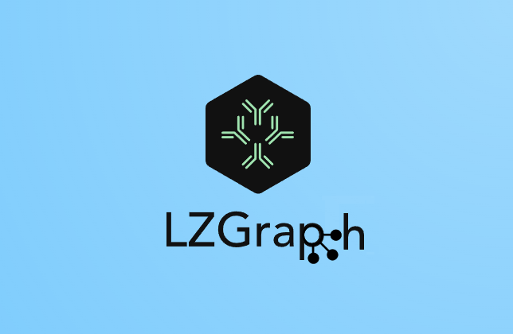

<p align="center">
  <a href="https://github.com/MuteJester/LZGraphs">
    
  </a>
</p>

<p align="center">
  <strong>High-performance LZ76 compression graphs for immune receptor repertoire analysis</strong>
</p>

<p align="center">
  <a href="https://pypi.org/project/LZGraphs/"></a>
  <a href="https://pypi.org/project/LZGraphs/"></a>
  <a href="https://github.com/MuteJester/LZGraphs/blob/master/LICENSE"></a>
  <a href="https://pypi.org/project/LZGraphs/"></a>
  <a href="https://github.com/MuteJester/LZGraphs/stargazers"></a>
</p>

<p align="center">
  <a href="https://MuteJester.github.io/LZGraphs/"><strong>Documentation</strong></a> &nbsp;&middot;&nbsp;
  <a href="https://MuteJester.github.io/LZGraphs/getting-started/quickstart/"><strong>Quick Start</strong></a> &nbsp;&middot;&nbsp;
  <a href="https://MuteJester.github.io/LZGraphs/api/lzgraph/"><strong>API Reference</strong></a> &nbsp;&middot;&nbsp;
  <a href="https://github.com/MuteJester/LZGraphs/issues">Report Bug</a>
</p>

---

**LZGraphs** is a Python library that transforms T-cell and B-cell receptor CDR3 sequences into probabilistic directed graphs using the Lempel-Ziv 76 compression algorithm. Built on a C core with Python bindings, it provides:

- **Exact generation probabilities** for any CDR3 sequence
- **LZ76-constrained sequence simulation** that guarantees valid outputs
- **Analytical diversity metrics** (Hill numbers, richness predictions, sharing spectra)
- **Graph algebra** (union, intersection, difference) for repertoire comparison
- **ML feature extraction** with fixed-size vectors for classification pipelines
- **Bayesian posterior personalization** to adapt population models to individuals
- **A CLI tool** (`lzg`) for terminal-based analysis

## Quick Start

```bash
pip install LZGraphs
```

```python
from LZGraphs import LZGraph

# Build a graph from CDR3 amino acid sequences
graph = LZGraph(
    ['CASSLEPSGGTDTQYF', 'CASSDTSGGTDTQYF', 'CASSLEPQTFTDTFFF',
     'CASSLGQGSTEAFF', 'CASSLGIRRT'],
    variant='aap',
)

# Score a sequence
log_p = graph.lzpgen('CASSLEPSGGTDTQYF')
print(f"log P(gen) = {log_p:.2f}")

# Simulate new sequences
result = graph.simulate(1000, seed=42)
print(f"Generated {len(result)} sequences")

# Diversity
print(f"D(1) = {graph.effective_diversity():.1f}")
print(f"D(2) = {graph.hill_number(2):.1f}")
```

### With gene annotation

```python
graph = LZGraph(
    sequences,
    variant='aap',
    v_genes=['TRBV16-1*01', 'TRBV1-1*01', ...],
    j_genes=['TRBJ1-2*01', 'TRBJ1-5*01', ...],
)

# Gene-constrained simulation
result = graph.simulate(100, sample_genes=True, seed=42)
print(result.v_genes[0], result.j_genes[0])
```

### Command line

```bash
lzg build repertoire.tsv -o rep.lzg
lzg score rep.lzg sequences.txt
lzg diversity rep.lzg
lzg simulate rep.lzg -n 10000 --seed 42
lzg compare healthy.lzg disease.lzg
```

## Graph Variants

One unified `LZGraph` class with three encoding schemes:

| Variant | Input | Node format | Best for |
|---------|-------|-------------|----------|
| `'aap'` | Amino acid CDR3 | `C_2`, `SL_6` | Most TCR/BCR analysis |
| `'ndp'` | Nucleotide CDR3 | `TG0_4` | Nucleotide-level analysis |
| `'naive'` | Any strings | `C`, `SL` | Motif discovery, ML features |

## Key Capabilities

### Scoring & Simulation

```python
# Log-probability of a sequence
graph.lzpgen('CASSLEPSGGTDTQYF')              # single
graph.lzpgen(['seq1', 'seq2', 'seq3'])         # batch → np.ndarray

# Simulate with optional gene constraints
result = graph.simulate(1000, seed=42)
result = graph.simulate(100, v_gene='TRBV5-1*01', j_gene='TRBJ2-7*01')
```

### Diversity & Analytics

```python
graph.effective_diversity()          # exp(Shannon entropy)
graph.hill_number(2)                 # inverse Simpson
graph.hill_numbers([0, 1, 2, 5])     # multiple orders → np.ndarray
graph.predicted_richness(100_000)    # expected unique seqs at depth
graph.predicted_overlap(10000, 50000)# expected shared sequences
graph.pgen_distribution()            # analytical Gaussian mixture
```

### Graph Algebra

```python
combined = graph_a | graph_b          # union
shared   = graph_a & graph_b          # intersection
unique_a = graph_a - graph_b          # difference
personal = population.posterior(patient_seqs, kappa=10.0)  # Bayesian update
```

### Repertoire Comparison

```python
from LZGraphs import jensen_shannon_divergence
jsd = jensen_shannon_divergence(graph_a, graph_b)  # 0 = identical, 1 = max different
```

### ML Feature Extraction

```python
# Project any repertoire into a fixed reference space
features = reference.feature_aligned(LZGraph(sample_seqs, variant='aap'))
stats = graph.feature_stats()           # 15-element summary vector
profile = graph.feature_mass_profile()  # position-based mass distribution
```

### Serialization

```python
graph.save('repertoire.lzg')           # fast binary format
loaded = LZGraph.load('repertoire.lzg')
```

## Documentation

Full documentation with tutorials, concept guides, and API reference:

**[https://MuteJester.github.io/LZGraphs/](https://MuteJester.github.io/LZGraphs/)**

- [Quick Start](https://MuteJester.github.io/LZGraphs/getting-started/quickstart/) — build your first graph in 5 minutes
- [Tutorials](https://MuteJester.github.io/LZGraphs/tutorials/) — graph construction, sequence analysis, diversity metrics
- [API Reference](https://MuteJester.github.io/LZGraphs/api/lzgraph/) — complete class and function reference
- [CLI Reference](https://MuteJester.github.io/LZGraphs/api/cli/) — terminal tool documentation

## Citation

If you use LZGraphs in your research, please cite:

```bibtex
@article{konstantinovsky2023lzgraphs,
  title={A Novel Approach to T-Cell Receptor Beta Chain (TCRB) Repertoire Encoding
         Using Lossless String Compression},
  author={Konstantinovsky, Thomas and Nagar, Maor and Louzoun, Yoram},
  journal={Bioinformatics},
  year={2023},
  publisher={Oxford University Press}
}
```

## Contributing

Contributions are welcome. Please open an issue or submit a pull request.

1. Fork the repository
2. Create a feature branch (`git checkout -b feature/my-feature`)
3. Commit your changes
4. Push and open a Pull Request

## License

MIT License. See [LICENSE](LICENSE) for details.

## Contact

Thomas Konstantinovsky — [thomaskon90@gmail.com](mailto:thomaskon90@gmail.com)

[GitHub](https://github.com/MuteJester/LZGraphs) · [PyPI](https://pypi.org/project/LZGraphs/) · [Documentation](https://MuteJester.github.io/LZGraphs/)
