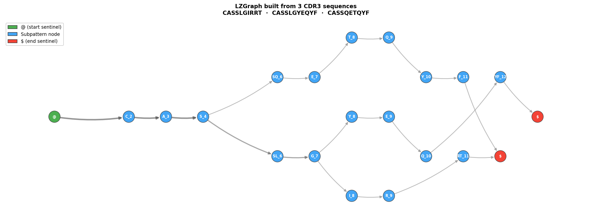

<p align="center">
  <a href="https://github.com/MuteJester/LZGraphs">
    
  </a>
</p>

<p align="center">
  <strong>LZ76 and FlashBack compression graphs for immune receptor repertoire analysis</strong>
</p>

<p align="center">
  <a href="https://github.com/MuteJester/LZGraphs/actions/workflows/test.yml"></a>
  <a href="https://pypi.org/project/LZGraphs/"></a>
  <a href="https://pypi.org/project/LZGraphs/"></a>
  <a href="https://github.com/MuteJester/LZGraphs/blob/master/LICENSE"></a>
  <a href="https://pypi.org/project/LZGraphs/"></a>
  <a href="https://github.com/MuteJester/LZGraphs/stargazers"></a>
</p>

<p align="center">
  <a href="https://MuteJester.github.io/LZGraphs/"><strong>Documentation</strong></a> &nbsp;&middot;&nbsp;
  <a href="https://MuteJester.github.io/LZGraphs/getting-started/quickstart-lzgraph/"><strong>Quick Start</strong></a> &nbsp;&middot;&nbsp;
  <a href="https://MuteJester.github.io/LZGraphs/api/lzgraph/"><strong>API Reference</strong></a> &nbsp;&middot;&nbsp;
  <a href="https://github.com/MuteJester/LZGraphs/issues">Report Bug</a>
</p>

---

**LZGraphs** is a Python library that turns T-cell and B-cell receptor CDR3 sequences into probabilistic directed graphs. It ships two graph families on a shared C core:

- [`LZGraph`](#quick-start-lzgraph): built from **Lempel-Ziv 76** compression. Supports V/J gene annotation, three encoding variants, and a `lzg` CLI.
- [`FlashBackGraph`](#quick-start-flashbackgraph): a **Markovian DAG** built from FlashBack tokenization (recursive run-peeling from both ends of the sentinel-wrapped sequence). Diversity, entropy, and path counting have closed-form forward-DP solutions; sequence simulation is still sampled.

Both classes share a common surface for scoring, simulation, diversity, graph algebra, posterior personalization, and binary serialization. See [When to use which](#when-to-use-which) for a comparison.

<p align="center">
  
  <br>
  <em>An <code>LZGraph</code> built from three CDR3s. <code>@</code> and <code>$</code> are start/end sentinels; subpattern nodes carry position suffixes.</em>
</p>

## Installation

```bash
pip install LZGraphs
```

Requires Python 3.9 or later. Wheels are published for Linux, macOS, and Windows (CPython 3.9–3.12). Release history: [CHANGELOG.md](CHANGELOG.md).

A container image with the `lzg` CLI preinstalled is also published to GHCR:

```bash
docker run --rm -v "$PWD:/data" ghcr.io/mutejester/lzgraphs build /data/repertoire.tsv -o /data/repertoire.lzg
```

## Input format

For programmatic use, all classes accept a plain list of CDR3 strings:

```python
LZGraph(['CASSLEPSGGTDTQYF', 'CASSDTSGGTDTQYF', ...], variant='aap')
```

For files, `LZGraph.from_file`, `FlashBackGraph.from_file`, and the `lzg` CLI (`lzg build` / `lzg flashback build`) all read through the same format-detection pipeline and accept the same formats, so any of the three build the identical graph from the identical file:

| Format | Layout | Example |
|---|---|---|
| Plain | one sequence per line | `CASSLEPSGGTDTQYF` |
| Seq + count | `sequence\tcount` (tab-separated) | `CASSLEPSGGTDTQYF\t42` |
| AIRR-compatible tabular | tab- or comma-separated, with header row | `junction_aa`, `v_call`, `j_call`, ... |
| FASTA | `>` header line, then sequence line(s) | `>seq1` / `CASSLEPSGGTDTQYF` |
| FASTQ | 4-line records: header, sequence, `+`, quality | `@seq1` / `CASSLEPSGGTDTQYF` / `+` / `IIIIIIIIIIIIIII` |

For AIRR-style tabular input: the sequence column is auto-detected from `junction_aa` / `cdr3_amino_acid` / `cdr3_aa` (variant `aap`), `junction` / `cdr3_rearrangement` (variant `ndp`), or any column named `sequence`/`cdr3`/`seq`. Gene calls come from `v_call` / `j_call` and must use IMGT-style notation (e.g. `TRBV5-1*01`); `FlashBackGraph` has no gene-annotation model, so a gene column present in the file is simply not read. Malformed sequence fields, and AIRR rows whose `productive` column is present and not truthy, are dropped and counted rather than built into the graph.

Compression is detected from file content, not the filename: gzip, bzip2, and xz are supported out of the box, and zstd is supported if the optional `zstandard` package is installed.

A clean, uncompressed, plain (or `sequence<TAB>count`) file streams straight into the C builder in constant memory, which is what makes `from_file` suitable for very large repertoires; everything else (compressed input, a headered/FASTA/FASTQ file, or a plain file with a byte-order mark, stray carriage returns, or a malformed line near its start) is instead read and validated in Python first, exactly as `lzg build` does for the same file. One residual case is intentionally not covered by that fast-path check: a malformed line far past the start of an otherwise clean, very large plain file can still reach the C builder and be ingested as-is rather than dropped, since fully validating a multi-gigabyte file up front would defeat the constant-memory streaming `from_file` exists to provide. For `LZGraph.from_file` and `lzg build`, passing `strict_input=True` / `--strict-input` validates the whole file up front if you need that stronger guarantee; `FlashBackGraph.from_file` and `lzg flashback build` do not currently expose an equivalent flag.

## Quick Start: LZGraph

```python
from LZGraphs import LZGraph

# Build a graph from CDR3 amino acid sequences
graph = LZGraph(
    ['CASSLEPSGGTDTQYF', 'CASSDTSGGTDTQYF', 'CASSLEPQTFTDTFFF',
     'CASSLGQGSTEAFF', 'CASSLGIRRT'],
    variant='aap',
)

# Score a sequence
log_p = graph.pgen('CASSLEPSGGTDTQYF')
print(f"log P(gen) = {log_p:.2f}")

# Simulate new sequences
result = graph.simulate(1000, seed=42)
print(f"Generated {len(result)} sequences")

# Diversity
print(f"D(1) = {graph.effective_diversity():.1f}")
print(f"D(2) = {graph.hill_number(2):.1f}")
```

### With gene annotation

```python
from LZGraphs import LZGraph

sequences = ['CASSLEPSGGTDTQYF', 'CASSDTSGGTDTQYF',
             'CASSLEPQTFTDTFFF', 'CASSLGQGSTEAFF']
graph = LZGraph(
    sequences,
    variant='aap',
    v_genes=['TRBV16-1*01', 'TRBV1-1*01', 'TRBV5-1*01', 'TRBV7-2*03'],
    j_genes=['TRBJ1-2*01', 'TRBJ1-5*01', 'TRBJ2-7*01', 'TRBJ1-2*01'],
)

# Gene-constrained simulation
result = graph.simulate(100, sample_genes=True, seed=42)
print(result.v_genes[0], result.j_genes[0])
```

### LZGraph encoding variants

| Variant | Input | Node format | Best for |
|---------|-------|-------------|----------|
| `'aap'` | Amino acid CDR3 | `C_2`, `SL_6` | Most TCR/BCR analysis |
| `'ndp'` | Nucleotide CDR3 | `TG0_4` | Nucleotide-level analysis |
| `'naive'` | Any strings | `C`, `SL` | Motif discovery, ML features |

### Command line

```bash
lzg build repertoire.tsv -o rep.lzg
lzg score rep.lzg sequences.txt
lzg diversity rep.lzg
lzg simulate rep.lzg -n 10000 --seed 42
lzg compare healthy.lzg disease.lzg
```

## Quick Start: FlashBackGraph

```python
from LZGraphs import FlashBackGraph

# Build a Markovian DAG from CDR3 sequences
graph = FlashBackGraph(
    ['CASSLEPSGGTDTQYF', 'CASSDTSGGTDTQYF', 'CASSLEPQTFTDTFFF',
     'CASSLGQGSTEAFF', 'CASSLGIRRT'],
)

# Score a sequence (exact forward DP, no MC)
log_p = graph.pgen('CASSLEPSGGTDTQYF')
print(f"log P(gen) = {log_p:.2f}")

# Simulate from the Markovian distribution
result = graph.simulate(1000, seed=42)

# Diversity, entropy, path count: closed-form via forward DP
print(f"D(1) = {graph.effective_diversity():.1f}")
print(f"D(2) = {graph.hill_number(2):.1f}")
print(f"# distinct paths = {graph.path_count:.3e}")

# SCALE: self-calibrated anomaly score for flagging atypical / error sequences
cal = graph.calibrate_scale(seed=42)               # calibrate once against the graph
print(f"SCALE = {graph.scale_score('CASSLEPSGGTDTQYF', cal):.2f}")  # higher = more anomalous
```

### Build from a file

`FlashBackGraph.from_file(path)` accepts any of the formats in [Input format](#input-format) above (plain, `seq<TAB>count`, AIRR-style tabular, FASTA, FASTQ, gzip/bzip2/xz-compressed) and is equivalent to running `lzg flashback build path -o out.lzg` and then loading the result: same detection, same validation, same graph. `LZGraph.from_file(path, variant='aap')` is the same guarantee for `LZGraph`, equivalent to `lzg build path -o out.lzg`.

```python
from LZGraphs import FlashBackGraph

# Write a tiny example file (one CDR3 per line, or seq<TAB>count for abundance)
with open('repertoire.tsv', 'w') as f:
    for s in ['CASSLEPSGGTDTQYF', 'CASSDTSGGTDTQYF', 'CASSLGQGSTEAFF']:
        f.write(s + '\n')

graph = FlashBackGraph.from_file('repertoire.tsv')
print(graph.n_nodes, 'nodes')
```

For a clean, uncompressed file like this one, `from_file` streams straight into the C builder in constant memory, so it is the right choice for very large repertoires. For incremental / checkpointed builds over repertoires too large to write to a single file up front, use `FlashBackStream`: same accumulator with `add_sequences()`, `snapshot()`, and `finalize()`. See the class docstring (`help(FlashBackStream)`) for the streaming protocol.

## When to use which

|  | `LZGraph` | `FlashBackGraph` |
|---|-----------|------------------|
| Tokenization | LZ76 dictionary | FlashBack (run-peeling) |
| Structure | LZ-constrained walks | Markovian DAG |
| Diversity / entropy / path count | Analytical (with MC where needed) | Closed-form forward DP |
| Self-calibrated anomaly scoring (SCALE) | No | Yes |
| V/J gene annotation & gene-conditioned simulation | Yes | No |
| Encoding variants | `aap`, `ndp`, `naive` | Single representation |
| CLI tool (`lzg`) | Yes | No |
| Streaming / incremental build | No | Yes (`FlashBackStream`) |

## Performance

Benchmark figures below are from a single CPU core on a 5,000-sequence amino-acid CDR3 repertoire (mean length 14.7 aa; resulting LZGraph has ~1,700 nodes, ~9,600 edges). See [docs/resources/benchmarks.md](docs/resources/benchmarks.md) for the full table and methodology.

| Operation | Throughput |
|---|---|
| Graph construction | ~50,000 sequences/sec (5k seqs in <100 ms) |
| `pgen()` scoring | ~5,000 sequences/sec (constant across batch sizes) |
| `simulate()` | ~4,800 sequences/sec |
| Hill numbers via MC (10k walks) | ~2 sec |
| Load / save `.lzg` | ~100× faster than rebuilding |

For repertoires of ~100k sequences and above, graph construction stays linear and saved `.lzg` files round-trip in seconds. For a clean, uncompressed input file, FlashBackGraph's `from_file` and `FlashBackStream` paths operate in bounded memory; we have built and validated graphs with >70,000 nodes and >11M edges this way. (Compressed or headered input is decompressed and validated in memory first, same as `lzg build`; see [Input format](#input-format).)

## Key Capabilities

Every snippet in this section is paste-and-runnable after the **Setup** block below. `graph` flags a method that works on either class; `lz_graph` is an `LZGraph` instance and `fb_graph` is a `FlashBackGraph` instance. Methods marked LZGraph-only or FlashBackGraph-only are not implemented on the other class.

### Setup

```python
from LZGraphs import LZGraph, FlashBackGraph, jensen_shannon_divergence

seqs = ['CASSLEPSGGTDTQYF', 'CASSDTSGGTDTQYF', 'CASSLEPQTFTDTFFF',
        'CASSLGQGSTEAFF', 'CASSLGIRRT']
v_genes = ['TRBV5-1*01', 'TRBV5-1*01', 'TRBV5-1*01', 'TRBV7-2*03', 'TRBV7-2*03']
j_genes = ['TRBJ2-7*01', 'TRBJ2-7*01', 'TRBJ2-7*01', 'TRBJ1-2*01', 'TRBJ1-2*01']

lz_graph = LZGraph(seqs, variant='aap', v_genes=v_genes, j_genes=j_genes)
fb_graph = FlashBackGraph(seqs)
graph    = lz_graph                      # `graph` flags methods that work on either class

graph_a      = LZGraph(seqs[:3], variant='aap')
graph_b      = LZGraph(seqs[2:], variant='aap')
population   = LZGraph(seqs * 4, variant='aap')
patient_seqs = ['CASSLGIRRT', 'CASSLGQGSTEAFF']

lz_reference = population
lz_sample    = LZGraph(seqs, variant='aap')
```

### Scoring & Simulation

```python
# Log-probability of a sequence (works on LZGraph and FlashBackGraph alike)
graph.pgen('CASSLEPSGGTDTQYF')               # single → float
graph.pgen(['seq1', 'seq2', 'seq3'])          # batch  → np.ndarray

# Simulate (both classes)
result = graph.simulate(1000, seed=42)
result = lz_graph.simulate(100, v_gene='TRBV5-1*01', j_gene='TRBJ2-7*01')  # LZGraph only
```

### Diversity & Analytics

```python
graph.effective_diversity()          # exp(Shannon entropy)
graph.hill_number(2)                 # inverse Simpson
graph.hill_numbers([0, 1, 2, 5])     # multiple orders → np.ndarray

# LZGraph-only
lz_graph.pgen_distribution()         # analytical log-pgen distribution (Gaussian mixture)
lz_graph.predicted_richness(100_000) # expected unique seqs at depth
lz_graph.predicted_overlap(10000, 50000)        # expected shared sequences
lz_graph.predict_sharing([1000]*5, max_k=5)     # sharing spectrum across donors

# FlashBackGraph-only (closed-form)
fb_graph.path_count                  # exact count of distinct walks
cal = fb_graph.calibrate_scale(seed=0)          # self-calibrate the SCALE anomaly score (once)
fb_graph.scale_score('CASSLEPSGGTDTQYF', cal)   # SCALE: higher = more anomalous
fb_graph.pgen_moments()              # exact moments of log-pgen distribution
```

### Graph Algebra

```python
combined = graph_a | graph_b          # union          (LZGraph and FlashBackGraph)
shared   = graph_a & graph_b          # intersection   (both)
unique_a = graph_a - graph_b          # difference     (both)
personal = population.posterior(patient_seqs, kappa=10.0)  # Bayesian update (both)
```

### Repertoire Comparison

```python
jsd = jensen_shannon_divergence(graph_a, graph_b)  # natural log (nats): 0.0 identical, ln(2) ≈ 0.693 disjoint
```

### ML Feature Extraction

```python
graph.feature_stats()                 # 15-element summary vector (both classes)

# LZGraph-only
lz_reference.feature_aligned(lz_sample)   # project sample into a fixed reference space
lz_graph.feature_mass_profile()           # position-based mass distribution
```

### Serialization

```python
# Both classes use the same .lzg binary format, but each file is class-specific.
lz_graph.save('rep_lz.lzg')
loaded_lz = LZGraph.load('rep_lz.lzg')

fb_graph.save('rep_fb.lzg')
loaded_fb = FlashBackGraph.load('rep_fb.lzg')
```

## Documentation

Full documentation with tutorials, concept guides, and API reference:

**[https://MuteJester.github.io/LZGraphs/](https://MuteJester.github.io/LZGraphs/)**

- [Quick Start](https://MuteJester.github.io/LZGraphs/getting-started/quickstart-lzgraph/): build your first graph in 5 minutes
- [Tutorials](https://MuteJester.github.io/LZGraphs/tutorials/): graph construction, sequence analysis, diversity metrics
- [API Reference](https://MuteJester.github.io/LZGraphs/api/lzgraph/): complete class and function reference
- [CLI Reference](https://MuteJester.github.io/LZGraphs/api/cli/): terminal tool documentation

## Citation

If you use LZGraphs in published research, please cite the methods paper. If you also want to cite a specific software version, add the software entry below.

```bibtex
@article{konstantinovsky2023novel,
  title={A novel approach to T-cell receptor beta chain ({TCRB}) repertoire encoding using lossless string compression},
  author={Konstantinovsky, Thomas and Yaari, Gur},
  journal={Bioinformatics},
  volume={39},
  number={7},
  pages={btad426},
  year={2023},
  publisher={Oxford University Press},
  doi={10.1093/bioinformatics/btad426}
}

@software{lzgraphs_software,
  author={Konstantinovsky, Thomas},
  title={{LZGraphs}: {LZ76} and {FlashBack} compression graphs for immune repertoire analysis},
  url={https://github.com/MuteJester/LZGraphs},
  year={2026}
}
```

## Contributing

Contributions are welcome. Please open an issue or submit a pull request.

### Local development setup

LZGraphs builds a CPython extension from a C library at install time, so a working C toolchain is required:

- **Linux**: `gcc` or `clang` (any version supporting C11)
- **macOS**: Xcode command-line tools (`xcode-select --install`)
- **Windows**: Visual Studio Build Tools with the "Desktop development with C++" workload

Then:

```bash
git clone https://github.com/MuteJester/LZGraphs.git
cd LZGraphs
pip install -e ".[dev]"   # editable install + dev extras (pytest, pytest-cov, ruff, scipy, build)
pytest                    # run the test suite (~505 tests)
```

### PR checklist

1. Fork the repository
2. Create a feature branch (`git checkout -b feature/my-feature`)
3. Add tests for new functionality; make sure `pytest` and `pytest tests/regression/` both pass
4. Commit your changes (small, focused commits preferred)
5. Push and open a Pull Request describing the motivation and any API changes

## License

MIT License. See [LICENSE](LICENSE) for details.

## Contact

Thomas Konstantinovsky, [thomaskon90@gmail.com](mailto:thomaskon90@gmail.com)

[GitHub](https://github.com/MuteJester/LZGraphs) · [PyPI](https://pypi.org/project/LZGraphs/) · [Documentation](https://MuteJester.github.io/LZGraphs/)
