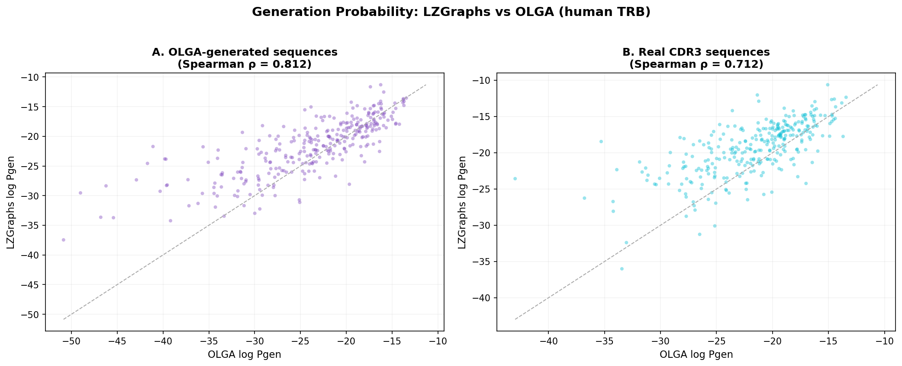
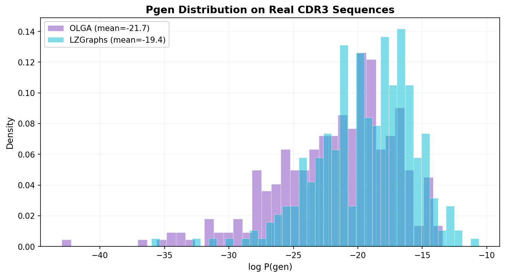
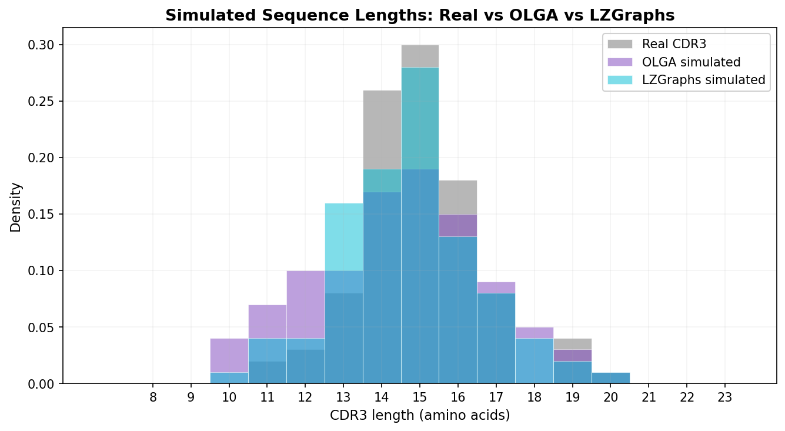
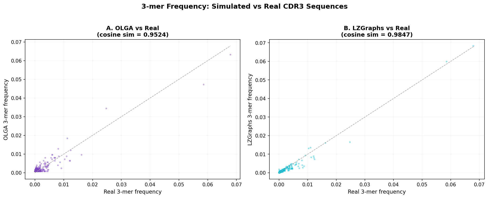

# Comparison with IGoR, OLGA, and SONIA

LZGraphs takes a fundamentally different approach to repertoire analysis than the established V(D)J recombination tools. This page presents an **empirical comparison** — how do the models agree on real data? — along with a conceptual overview of when to use which tool.

---

## Two paradigms

The immune repertoire modeling ecosystem has two distinct approaches:

**Mechanistic (IGoR → OLGA → SONIA):** Explicitly model the V(D)J recombination process — gene segment choices, deletions, N-insertions, selection pressures. These tools require germline reference databases and (for IGoR) sequence alignment. They answer *why* a sequence was generated: which gene segments, what insertion/deletion profiles.

**Information-theoretic (LZGraphs):** Compress sequences into a directed graph using LZ76, capturing statistical structure without assuming any generative mechanism. Requires only a list of CDR3 strings — no germline databases, no alignment, no pre-fitted models. Answers *how likely, how diverse, how similar*.

Neither approach is "better" — they answer different questions and are often complementary.

---

## Empirical comparison: generation probabilities

The most direct comparison is on **generation probability (Pgen)**: given a CDR3 sequence, how likely is it under each model?

We compared LZGraphs against OLGA (the gold-standard V(D)J Pgen tool) using two approaches:

1. **OLGA-generated sequences** — 5,000 sequences sampled from OLGA's default human TRB recombination model, scored by both OLGA and LZGraphs
2. **Real CDR3 sequences** — 300 sequences from a real TCR repertoire, scored by both models

### Pgen rank correlation

<figure markdown="span">
  { width="100%" }
  <figcaption><strong>Generation probability correlation between LZGraphs and OLGA.</strong> (A) 300 sequences generated by OLGA's V(D)J model (Spearman ρ = 0.81). (B) 300 real CDR3 sequences from a human TRB repertoire (ρ = 0.71). Each dot is one sequence; the dashed line is the identity. Despite completely different mathematical foundations, the two models largely agree on which sequences are common and which are rare.</figcaption>
</figure>

**Key finding:** The two models show strong rank correlation (ρ = 0.81 on synthetic data, ρ = 0.71 on real data), meaning they largely agree on the *ordering* of sequences from most to least probable. This is notable because:

- OLGA computes Pgen by marginalizing over all V(D)J recombination scenarios — a mechanistic model with dozens of learned parameters
- LZGraphs computes Pgen from LZ76-constrained transition probabilities — a data-driven compression model with no biological assumptions

The correlation is not perfect (and shouldn't be): OLGA's probabilities reflect the *universal recombination process*, while LZGraphs' probabilities reflect the *specific repertoire's statistical patterns*, including selection effects.

### Pgen distribution shape

<figure markdown="span">
  { width="90%" }
  <figcaption><strong>Distribution of log-Pgen scores on real CDR3 sequences.</strong> OLGA (purple) and LZGraphs (cyan) both produce bell-shaped distributions. LZGraphs assigns slightly higher probabilities on average (mean −19.4 vs OLGA's −21.7) because it captures repertoire-specific patterns beyond the universal V(D)J model.</figcaption>
</figure>

Both models produce a roughly Gaussian distribution of log-probabilities, spanning about 30 orders of magnitude. The rightward shift of LZGraphs is expected: it's trained directly on the data, so it assigns higher probability to patterns that are enriched in this particular repertoire (including selection effects), while OLGA reflects only the pre-selection recombination process.

---

## Simulation quality

Beyond scoring, both models can **generate** new sequences. How realistic are the generated sequences?

### Length distribution

<figure markdown="span">
  { width="90%" }
  <figcaption><strong>CDR3 length distributions: real sequences (gray) vs OLGA-simulated (purple) vs LZGraphs-simulated (cyan).</strong> LZGraphs closely matches the training data's length profile because it's built from that data. OLGA generates from a universal V(D)J model, producing a broader distribution with more short sequences (10-12 aa) that are underrepresented in this particular repertoire.</figcaption>
</figure>

LZGraphs simulations match the training data's length distribution almost exactly — this is by design, since the graph encodes the observed length frequencies. OLGA's universal model produces a slightly different shape because it doesn't know about this specific repertoire's V-gene usage bias or selection pressures.

### 3-mer motif frequencies

<figure markdown="span">
  { width="100%" }
  <figcaption><strong>3-mer amino acid frequencies in simulated vs real sequences.</strong> (A) OLGA simulations vs real (cosine similarity 0.952). (B) LZGraphs simulations vs real (cosine similarity 0.985). Each dot is one of ~8,000 observed 3-mers; the dashed line is the identity. Both models capture the amino acid composition, with LZGraphs achieving higher fidelity because it's trained on the specific data.</figcaption>
</figure>

Both models reproduce real 3-mer frequencies well, but LZGraphs achieves higher cosine similarity (0.985 vs 0.952). This advantage comes from learning data-specific motifs — for instance, if the repertoire is enriched for certain V genes that produce particular amino acid patterns, LZGraphs captures this while OLGA uses a universal model.

---

## When to use which tool

| Question | Best tool | Why |
|:---------|:----------|:----|
| What is the V(D)J recombination probability of a CDR3? | **OLGA** | Marginalizes over all recombination scenarios |
| How is my repertoire shaped by selection? | **SONIA** | Learns selection factors relative to pre-selection baseline |
| What V/D/J genes, deletions, insertions produced this sequence? | **IGoR** | Full mechanistic model of recombination |
| How diverse is this repertoire? | **LZGraphs** | Hill numbers, entropy, occupancy predictions |
| How similar are two repertoires? | **LZGraphs** | JSD, graph algebra, cross-scoring |
| How many unique sequences at depth X? | **LZGraphs** | Poisson occupancy model |
| What fixed-size features for a classifier? | **LZGraphs** | Reference-aligned vectors, mass profiles, stats |
| Bayesian personalization of a population model? | **LZGraphs** | Dirichlet posterior updates |
| Generate sequences matching *this specific repertoire*? | **LZGraphs** | Trained directly on the data |
| Generate sequences from *the universal recombination process*? | **OLGA** | V(D)J mechanistic model |

### Using them together

These tools are complementary. A typical combined workflow:

1. **IGoR** — learn the recombination model from reference data
2. **OLGA** — compute mechanistic Pgen for your sequences
3. **LZGraphs** — build a graph for diversity, comparison, ML features, and occupancy predictions
4. **SONIA** — infer selection if comparing naive vs. experienced repertoires

LZGraphs excels at **repertoire-level** questions (how diverse? how similar? how many at depth X?) that the V(D)J tools don't address. The V(D)J tools excel at **mechanism-level** questions (what genes? what selection?) that LZGraphs doesn't address.

---

## Technical comparison

| | IGoR | OLGA | SONIA | LZGraphs |
|:---|:---:|:---:|:---:|:---:|
| **Approach** | V(D)J Bayesian network | DP over V(D)J model | Max entropy selection | LZ76 compression graph |
| **Learn from data** | Yes (EM) | No (uses IGoR) | Partial (selection only) | Yes (direct from CDR3s) |
| **Requires germline DB** | Yes | Yes | Yes | No |
| **Requires alignment** | Yes | No | No | No |
| **Compute Pgen** | Yes | Yes | Yes (post-selection) | Yes |
| **Simulate sequences** | Yes | Yes | Yes | Yes |
| **Diversity metrics** | — | — | — | Hill numbers, entropy, perplexity |
| **Richness prediction** | — | — | — | Poisson occupancy |
| **Repertoire comparison** | — | — | — | JSD, graph algebra |
| **ML features** | — | — | — | 3 strategies |
| **Bayesian posteriors** | — | — | — | Dirichlet updates |
| **Selection inference** | — | — | Yes | — |
| **V(D)J decomposition** | Yes | Partial | Partial | — |
| **Language** | C/C++ | Python | Python + TF | C + Python |
| **Dependencies** | autotools, POSIX | numba (opt.) | TensorFlow | numpy only |

---

## Methodology

The comparisons above were produced using:

- **OLGA v1.3.0** with the default `human_T_beta` model (pre-fitted on IGoR default parameters)
- **LZGraphs v3.0.2** trained on 5,000 CDR3 amino acid sequences from the same repertoire
- **Real data:** 5,000 TRB CDR3 amino acid sequences with V/J gene annotations
- Pgen scored on 300 sequences; 3-mer analysis on the full 5,000
- Spearman rank correlation for Pgen comparison; cosine similarity for 3-mer comparison

---

## References

- **IGoR:** Marcou, Q., Mora, T., & Walczak, A. M. (2018). High-throughput immune repertoire analysis with IGoR. *Nature Communications*, 9(1), 561. [doi:10.1038/s41467-018-02832-w](https://doi.org/10.1038/s41467-018-02832-w)
- **OLGA:** Sethna, Z., Elhanati, Y., Callan, C. G., Walczak, A. M., & Mora, T. (2019). OLGA: fast computation of generation probabilities of B- and T-cell receptor amino acid sequences and motifs. *Bioinformatics*, 35(17), 2974–2981. [doi:10.1093/bioinformatics/btz035](https://doi.org/10.1093/bioinformatics/btz035)
- **SONIA:** Sethna, Z., Isacchini, G., Dupic, T., Mora, T., Walczak, A. M., & Elhanati, Y. (2020). Population variability in the generation and selection of T-cell repertoires. *PLOS Computational Biology*, 16(12), e1008394. [doi:10.1371/journal.pcbi.1008394](https://doi.org/10.1371/journal.pcbi.1008394)
- **soNNia:** Isacchini, G., Walczak, A. M., Mora, T., & Nourmohammad, A. (2021). Deep generative selection models of T and B cell receptor repertoires with soNNia. *PNAS*, 118(14), e2023141118. [doi:10.1073/pnas.2023141118](https://doi.org/10.1073/pnas.2023141118)
- **LZGraphs:** Konstantinovsky, T. & Yaari, G. (2023). A novel approach to T-cell receptor beta chain (TCRB) repertoire encoding using lossless string compression. *Bioinformatics*, 39(7), btad426. [doi:10.1093/bioinformatics/btad426](https://doi.org/10.1093/bioinformatics/btad426)

---

## See Also

- [Probability Model](probability-model.md) — how LZGraphs computes generation probabilities
- [Diversity Metrics tutorial](../tutorials/diversity-metrics.md) — features unique to LZGraphs
- [Feature Extraction](../how-to/feature-extraction.md) — ML capabilities with no equivalent in the V(D)J tools
