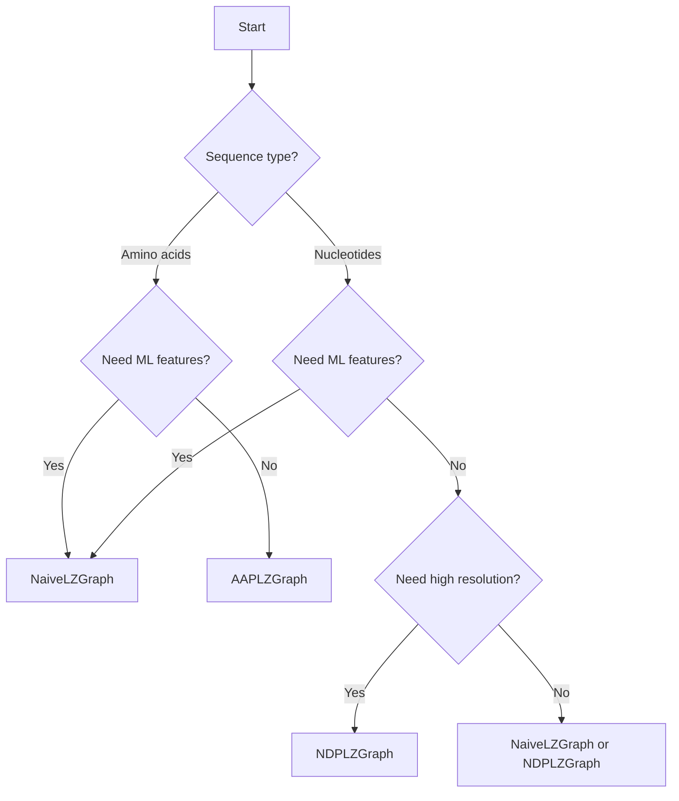

# Graph Types

LZGraphs provides three graph types, each optimized for different analysis scenarios. This guide helps you choose the right one.

## Overview Comparison

| Feature | AAPLZGraph | NDPLZGraph | NaiveLZGraph |
|---------|------------|------------|--------------|
| **Input** | Amino acids | Nucleotides | Any strings |
| **Column** | `cdr3_amino_acid` | `cdr3_rearrangement` | List of strings |
| **Position encoding** | Single (end) | Reading frame + position | None |
| **V/J gene support** | Yes | Yes | No |
| **Alphabet size** | 20 AA | 4 NT | Configurable |
| **Graph density** | Medium | Low | Configurable |
| **Memory usage** | Medium | High | Configurable |
| **Abundance weighting** | `abundance` column | `abundance` column | `abundances` parameter |
| **Best for** | Most TCR analysis | Nucleotide-level | ML features |

## AAPLZGraph

**Amino Acid Positional LZGraph**

### When to Use

- Analyzing amino acid CDR3 sequences
- Need V/J gene annotations
- Standard repertoire analysis
- Moderate-sized repertoires

### Node Format

```
<pattern>_<end_position>
```

Example: `SL_5` means pattern "SL" ending at position 5.

### Example

```python
from LZGraphs import AAPLZGraph
import pandas as pd

data = pd.DataFrame({
    'cdr3_amino_acid': ['CASSLEPSGGTDTQYF', 'CASSDTSGGTDTQYF'],
    'V': ['TRBV16-1*01', 'TRBV1-1*01'],
    'J': ['TRBJ1-2*01', 'TRBJ1-5*01']
})

graph = AAPLZGraph(data, verbose=True)
```

### Key Features

- **Position-aware**: Same pattern at different positions = different nodes
- **Gene-aware**: Edges carry V/J gene annotations
- **Compact**: 20-letter alphabet keeps graph manageable
- **Abundance support**: Include an `abundance` column in the DataFrame to weight sequences by clonotype frequency

---

## NDPLZGraph

**Nucleotide Reading Frame Positional LZGraph**

### When to Use

- Analyzing nucleotide sequences
- Need fine-grained positional information
- Studying codon usage or frame
- Have memory for larger graphs

### Node Format

```
<pattern><reading_frame>_<position>
```

Example: `TG2_4` means pattern "TG" at reading frame 2, ending at position 4.

### Example

```python
from LZGraphs import NDPLZGraph
import pandas as pd

data = pd.DataFrame({
    'cdr3_rearrangement': [
        'TGTGCCAGCAGTTTAGAGCCCAGCGGGGGG...',
        'TGTGCCAGCAGTGACACTTCAGGGGGGACT...'
    ],
    'V': ['TRBV16-1*01', 'TRBV1-1*01'],
    'J': ['TRBJ1-2*01', 'TRBJ1-5*01']
})

graph = NDPLZGraph(data, verbose=True)
```

### Key Features

- **Reading frame + position**: Captures codon context and pattern boundaries
- **Higher resolution**: Better for sequence-level analysis
- **Larger graphs**: 4-letter alphabet but more positions
- **Abundance support**: Include an `abundance` column in the DataFrame to weight sequences by clonotype frequency

---

## NaiveLZGraph

**Naive LZGraph** (No positional encoding)

### When to Use

- Cross-repertoire comparisons
- Feature extraction for machine learning
- Fixed-dimension representations
- Memory-constrained environments

### Node Format

```
<pattern>
```

Just the raw pattern, no position information.

### Example

```python
from LZGraphs import NaiveLZGraph
from LZGraphs.utilities import generate_kmer_dictionary

# Create shared dictionary
dictionary = generate_kmer_dictionary(6)  # All patterns up to length 6

# Build graphs with consistent node sets
sequences1 = data1['cdr3_rearrangement'].tolist()
sequences2 = data2['cdr3_rearrangement'].tolist()

graph1 = NaiveLZGraph(sequences1, dictionary)
graph2 = NaiveLZGraph(sequences2, dictionary)

# Feature vectors have same dimensions
features1 = graph1.eigenvector_centrality()
features2 = graph2.eigenvector_centrality()
```

### Key Features

- **Fixed dictionary**: Same nodes across all repertoires
- **Consistent dimensions**: Ideal for ML pipelines
- **No position info**: Simpler but less detailed
- **Abundance support**: Pass the `abundances` parameter (list of ints) to weight sequences by frequency

---

## Choosing the Right Type



### Quick Decision Guide

1. **"I want standard TCR analysis"** → AAPLZGraph
2. **"I want nucleotide-level detail"** → NDPLZGraph
3. **"I want to compare multiple repertoires with ML"** → NaiveLZGraph
4. **"I want consistent feature vectors"** → NaiveLZGraph with shared dictionary

---

## Memory and Performance

### Graph Size Estimates

For a repertoire of N sequences with average length L:

| Graph Type | Approximate Nodes | Approximate Edges |
|------------|-------------------|-------------------|
| AAPLZGraph | O(20 × L) | O(N × L) |
| NDPLZGraph | O(4 × L²) | O(N × L) |
| NaiveLZGraph | O(dictionary size) | O(unique patterns) |

### Practical Recommendations

```python
# Check your graph size
print(f"Nodes: {graph.graph.number_of_nodes()}")
print(f"Edges: {graph.graph.number_of_edges()}")

# Estimate memory (rough)
import sys
size_mb = sys.getsizeof(graph) / (1024 * 1024)
print(f"Approximate size: {size_mb:.1f} MB")
```

---

## Converting Between Types

You cannot directly convert between graph types, but you can:

### Re-encode Sequences

```python
# Get sequences from one format
aa_sequences = data['cdr3_amino_acid'].tolist()

# Build different graph types
aa_graph = AAPLZGraph(data)

# For NaiveLZGraph, use the sequences directly
naive_graph = NaiveLZGraph(
    aa_sequences,
    generate_kmer_dictionary(6)
)
```

### Compare Analyses

```python
# Same repertoire, different representations
pgen_aa = aa_graph.walk_probability(sequence)
pgen_naive = naive_graph.walk_probability(
    lempel_ziv_decomposition(sequence)
)

print(f"AAPLZGraph Pgen:   {pgen_aa:.2e}")
print(f"NaiveLZGraph Pgen: {pgen_naive:.2e}")
```

---

## Next Steps

- [Probability Model](probability-model.md) - How graphs calculate probabilities
- [LZ76 Algorithm](lz76-algorithm.md) - Understand the encoding
- [API Reference](../api/index.md) - Detailed class documentation
