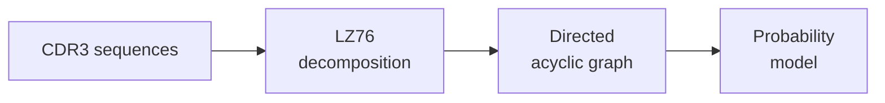

# Concepts

This section explains the theory behind LZGraphs — not how to use the API (that's in [Tutorials](../tutorials/index.md) and [How-To Guides](../how-to/index.md)), but *why* things work the way they do.

---

## How LZGraphs works, in a nutshell

LZGraphs transforms a collection of sequences into a **probabilistic directed graph** through three steps:

**Step 1: Decomposition.** Each sequence is broken into subpatterns using the LZ76 compression algorithm. This is deterministic and lossless — the original sequence can be reconstructed from its subpatterns.

**Step 2: Graph construction.** Subpatterns become nodes, and transitions between consecutive subpatterns become edges. When processing a repertoire of thousands of sequences, shared subpatterns merge into shared nodes, creating a compact graph that captures the repertoire's structural patterns.

**Step 3: Probability model.** Edge weights are normalized to form transition probabilities. The graph now defines a probability distribution over sequences: the probability of any sequence is the product of transition probabilities along its walk through the graph.

This representation is powerful because it simultaneously serves as:

- A **generative model** — you can simulate new sequences by random walks
- A **discriminative model** — you can score any sequence's probability
- A **structural summary** — the graph's topology reflects the repertoire's diversity and complexity
- A **feature extractor** — node frequencies provide fixed-size ML features

## The key innovation: LZ76 constraints

What makes LZGraphs different from a simple Markov chain is the **LZ76 dictionary constraint**. In a standard Markov model, any successor is always available. In LZGraphs, the set of valid transitions at each step depends on **what subpatterns have already been emitted** during the current walk.

This means:

- The model is **non-Markovian** — the transition probabilities depend on the full walk history (via the LZ dictionary)
- Every simulated sequence is a **valid LZ76 decomposition** — you can't generate biologically impossible patterns
- The probability of each simulated sequence is **exact** — computed as the product of renormalized transition probabilities

This is a fundamentally stronger guarantee than most sequence generative models provide.

---

## Concept pages

### [LZ76 Algorithm](lz76-algorithm.md)
The compression algorithm at the heart of LZGraphs. Explains how sequences are decomposed into subpatterns, with worked examples and a step-by-step dictionary-building walkthrough.

### [Graph Variants](graph-types.md)
The three encoding schemes — AAP (amino acid positional), NDP (nucleotide double positional), and Naive (position-free). When to use each, how they differ, and what tradeoffs they make.

### [Probability Model](probability-model.md)
How LZGraphs calculates sequence generation probabilities, enforces LZ76 constraints during walks, and supports Bayesian posterior updates for personalized models.

### [Distribution Analytics](distribution-analytics.md)
The mathematical foundations behind Hill numbers, occupancy predictions, sharing spectra, and the analytical PGEN distribution — all computed from the graph without simulation.

---

## Why graphs for immune repertoires?

Immune repertoires are produced by V(D)J recombination — a stochastic process that generates enormous sequence diversity from a structured template. This creates sequences with:

- **Shared prefixes** from germline V-gene segments
- **Variable junctions** from random nucleotide insertions/deletions
- **Shared suffixes** from germline J-gene segments
- **Position-dependent structure** — the same amino acid at different positions has different biological meaning

A directed graph naturally captures all of these properties. Shared V-gene prefixes become shared paths at the start of the graph; junctional diversity creates branching in the middle; J-gene suffixes create convergence at the end. The graph structure *is* the repertoire structure.

| What you want to know | Traditional approach | LZGraphs approach |
|:---|:---|:---|
| Is this sequence plausible? | Align to references | `graph.lzpgen(seq)` — exact probability |
| Generate realistic sequences | Statistical model (OLGA, IGoR) | `graph.simulate(n)` — LZ-constrained walks |
| How diverse is the repertoire? | Species richness estimators | `graph.hill_number(alpha)` — analytical |
| How similar are two repertoires? | Sequence overlap counting | `jensen_shannon_divergence(g1, g2)` |
| What's unique to this sample? | Differential expression | `disease_graph - healthy_graph` |
| How many unique seqs at depth d? | Extrapolation models | `graph.predicted_richness(d)` — exact formula |
