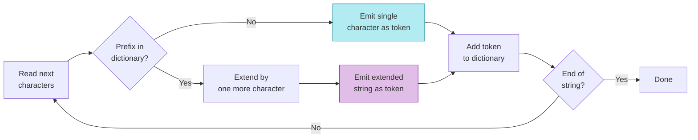

# LZ76 Algorithm

The Lempel-Ziv 1976 (LZ76) algorithm is the foundation of LZGraphs. It decomposes any string into a sequence of **shortest novel subpatterns** — and this decomposition is what creates the graph structure.

Understanding LZ76 is key to understanding why the graph looks the way it does, why certain sequences share nodes, and what the "dictionary constraint" means.

---

## The core rule



LZ76 processes a string from left to right, building up a **dictionary** of patterns it has seen. At each step, it does the following:

> **Find the longest prefix of the remaining string that's already in the dictionary, then extend it by one character. The extended string becomes the next token, and it's added to the dictionary.**

If no prefix is in the dictionary (which happens at the very start, or with a character never seen before), the token is just a single character.

## Worked example

Let's decompose `CASSLEPSGGTDTQYF` step by step. We'll track the dictionary at each step:

| Step | Remaining string | Longest known prefix | Extend by 1 | Token | Dictionary after |
|:---:|:---|:---|:---|:---:|:---|
| 1 | **C**ASSLEPSGGTDTQYF | (none) | — | **C** | {C} |
| 2 | **A**SSLEPSGGTDTQYF | (none) | — | **A** | {C, A} |
| 3 | **S**SLEPSGGTDTQYF | (none) | — | **S** | {C, A, S} |
| 4 | **SL**EPSGGTDTQYF | S is known | +L | **SL** | {C, A, S, SL} |
| 5 | **E**PSGGTDTQYF | (none) | — | **E** | {C, A, S, SL, E} |
| 6 | **P**SGGTDTQYF | (none) | — | **P** | {..., P} |
| 7 | **SG**GTDTQYF | S is known | +G | **SG** | {..., SG} |
| 8 | **G**TDTQYF | (none) | — | **G** | {..., G} |
| 9 | **T**DTQYF | (none) | — | **T** | {..., T} |
| 10 | **D**TQYF | (none) | — | **D** | {..., D} |
| 11 | **TQ**YF | T is known | +Q | **TQ** | {..., TQ} |
| 12 | **Y**F | (none) | — | **Y** | {..., Y} |
| 13 | **F** | (none) | — | **F** | {..., F} |

**Result:** `[C, A, S, SL, E, P, SG, G, T, D, TQ, Y, F]` — 13 tokens from 16 characters.

Notice what happened at step 4: the algorithm saw `S` (already in the dictionary from step 3), so it extended by one character to get `SL` — a novel 2-character token. This "extend-by-one" rule is the heart of LZ76.

```python
from LZGraphs import lz76_decompose

tokens = lz76_decompose("CASSLEPSGGTDTQYF")
print(tokens)
# ['C', 'A', 'S', 'SL', 'E', 'P', 'SG', 'G', 'T', 'D', 'TQ', 'Y', 'F']
```

---

## Key properties

### Deterministic

The same input always produces the same decomposition. There's no randomness in LZ76 — it's a **greedy** algorithm that always takes the shortest novel pattern.

### Lossless

The original string is exactly reconstructed by concatenating the tokens:

```python
tokens = lz76_decompose("CASSLEPSGGTDTQYF")
assert ''.join(tokens) == "CASSLEPSGGTDTQYF"  # always true
```

### Unique tokens (almost)

Each token is novel when it's first created — it wasn't in the dictionary before. The only exception is the **last token** of a string, which might repeat (because the string ends before we can extend a known prefix). LZGraphs handles this with sentinel characters (see below).

### Compression reflects complexity

Repetitive sequences compress well (fewer tokens); diverse sequences don't:

```python
# Highly repetitive — compresses to just 4 tokens
lz76_decompose("AAAAAAAAAAAA")
# ['A', 'AA', 'AAA', 'AAAAAA']

# Maximally diverse — no compression at all
lz76_decompose("ABCDEFGHIJKL")
# ['A', 'B', 'C', 'D', 'E', 'F', 'G', 'H', 'I', 'J', 'K', 'L']
```

This means the **number of LZ76 tokens relative to sequence length** is a natural measure of complexity. A CDR3 with many novel subpatterns is structurally more complex than one that repeats the same motifs.

---

## From tokens to graph nodes

The raw LZ76 decomposition gives you tokens like `[C, A, S, SL, E, ...]`. But the graph needs to distinguish the same character at different positions — because in a CDR3 sequence, an `S` at position 3 (the conserved serine in `CAS...`) is biologically very different from an `S` at position 10 (in the junctional region).

LZGraphs augments each token with **positional information** depending on the graph variant:

### AAP encoding (amino acid positional)

Each node is labeled `{subpattern}_{end_position}`. Positions start at 2 because position 1 is reserved for the internal `@` start sentinel:

| Token | End position | Node label |
|:---:|:---:|:---:|
| C | 2 | `C_2` |
| A | 3 | `A_3` |
| S | 4 | `S_4` |
| SL | 6 | `SL_6` |
| E | 7 | `E_7` |

### NDP encoding (nucleotide double positional)

For nucleotide sequences, nodes also encode the **reading frame** (codon position 0, 1, or 2): `{subpattern}{frame}_{position}`.

### Naive encoding (position-free)

No positional information at all — nodes are just the raw subpatterns. This creates smaller, more connected graphs but loses positional specificity.

!!! info "Which encoding should I use?"
    See [Graph Variants](graph-types.md) for a detailed comparison. The short answer: use `'aap'` for amino acid CDR3s (the default), `'ndp'` for nucleotide CDR3s, and `'naive'` for position-independent analysis.

---

## Sentinels: why they exist

You may have noticed the `@` and `$` nodes in the graph. These are **sentinel characters** that LZGraphs adds to each sequence before decomposition:

```
Original:  CASSLGIRRT
Wrapped:   @CASSLGIRRT$
```

**Why?**

1. **`@` (start sentinel):** Creates a single root node that all walks begin from. Without it, different sequences might start at different nodes, complicating the probability model.

2. **`$` (end sentinel):** Guarantees that the last token of every decomposition is novel. Without it, the last LZ76 token could be a repeat (because the string ends before we can extend), which would violate the graph's probability model. The `$` ensures every walk ends cleanly at a terminal node.

The sentinels are internal implementation details — they're hidden by default when you access `graph.nodes` or `graph.edges`, but visible via `graph.all_nodes` and `graph.all_edges`.

---

## How shared prefixes create shared paths

When you build a graph from many sequences, sequences with the same prefix share the same initial nodes. This is the fundamental compression that makes LZGraphs work:

```python
lz76_decompose("CASSLGIRRT")    # [C, A, S, SL, G, I, R, RT]
lz76_decompose("CASSLGYEQYF")  # [C, A, S, SL, G, Y, E, QY, F]
lz76_decompose("CASSQETQYF")   # [C, A, S, SQ, E, TQ, Y, F]
```

All three sequences share the `C → A → S` prefix (positions 2, 3, 4). After `S_4`, the graph branches:

- Two sequences continue with `SL_6` (the `CASSL...` family)
- One branches to `SQ_6` (the `CASSQ...` family)

This branching point tells you something biologically meaningful: the repertoire has a common `CAS` prefix (from the V gene), then diversifies at the junctional region.

---

## Formal definition

For the mathematically inclined, the LZ76 decomposition of a string $s = s_1 s_2 \ldots s_n$ is defined recursively:

1. Initialize dictionary $\mathcal{D} = \emptyset$
2. Set position $i = 1$
3. While $i \leq n$:
    - Find the longest prefix $s_i \ldots s_{i+k-1}$ that is in $\mathcal{D}$
    - If $k = 0$: emit token $s_i$, set $k = 1$
    - Else: emit token $s_i \ldots s_{i+k}$ (extend by one character)
    - Add the emitted token to $\mathcal{D}$
    - Advance: $i \leftarrow i + k$

The number of tokens $c(s)$ is the **LZ76 complexity** of the string. For a string of length $n$ over an alphabet of size $\sigma$, the complexity is bounded:

$$
c(s) \leq \frac{n}{\log_\sigma n} (1 + o(1))
$$

Random strings approach this upper bound; maximally repetitive strings achieve $c(s) = O(\log n)$.

---

## See Also

- [Graph Variants](graph-types.md) — how AAP, NDP, and Naive encode these tokens differently
- [Probability Model](probability-model.md) — how the graph defines transition probabilities
- [Graph Construction tutorial](../tutorials/graph-construction.md) — build and inspect a real graph
- [API: `lz76_decompose()`](../api/functions.md#lz76_decompose) — function reference
