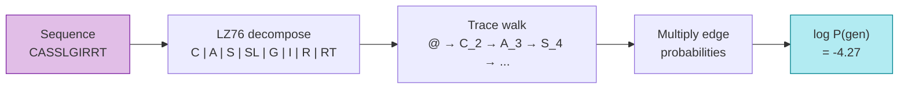

# Probability Model

LZGraphs defines a **probability distribution over sequences**. For any CDR3 string you give it, the graph can compute the exact probability that the repertoire would generate it. This page explains how that probability is calculated, why the LZ76 constraint matters, and how the model supports Bayesian updates.

---

## The generation probability (LZPGEN)



The probability of a sequence $s$ under an LZGraph is defined as the product of transition probabilities along the sequence's walk through the graph:

$$
P(s) = \prod_{i=0}^{n-1} P(w_{i+1} \mid w_i, \mathcal{D}_i)
$$

Where:

- $w_0 = @$ is the start sentinel node
- $w_1, w_2, \ldots, w_n$ are the graph nodes corresponding to the LZ76 tokens of $s$
- $\mathcal{D}_i$ is the **LZ76 dictionary** accumulated up to step $i$
- The walk ends when $w_n$ is a terminal (`$`) node

The crucial detail is the conditioning on $\mathcal{D}_i$ — the transition probability at each step depends not just on the current node, but on **what the walk has already emitted**. This makes the model non-Markovian.

---

## LZ-constrained normalization: a worked example

In a standard Markov chain, the transition probability from node $u$ to node $v$ is simply the edge weight $P(v \mid u)$. In LZGraphs, the situation is more nuanced.

Consider a node `S_4` with three outgoing edges:

| Edge | Count | Unconditional weight |
|:---|:---:|:---:|
| `S_4` → `SL_6` | 30 | 0.50 |
| `S_4` → `SD_6` | 20 | 0.33 |
| `S_4` → `SF_6` | 10 | 0.17 |

In a standard Markov model, the probability of transitioning to `SL_6` is always 0.50. But LZ76 imposes a constraint: **the destination subpattern must be valid under the current walk's dictionary**.

An edge to `SL_6` is valid only if:

1. The subpattern `SL` is **not** already in the walk's dictionary (it would be a repeat), AND
2. The prefix `S` **is** in the dictionary (since multi-character tokens must extend a known prefix by one character), OR the subpattern is a single character not yet seen.

Suppose at this point in the walk, the dictionary is $\mathcal{D} = \{C, A, S\}$. Then:

- `SL_6` → prefix `S` is in $\mathcal{D}$, full token `SL` is NOT in $\mathcal{D}$ → **valid**
- `SD_6` → prefix `S` is in $\mathcal{D}$, full token `SD` is NOT in $\mathcal{D}$ → **valid**
- `SF_6` → prefix `S` is in $\mathcal{D}$, full token `SF` is NOT in $\mathcal{D}$ → **valid**

All three are valid, so the probabilities remain the same as the unconditional weights. But now suppose a different walk has already emitted `SL` earlier (dictionary $\mathcal{D} = \{C, A, S, SL, \ldots\}$). Then:

- `SL_6` → `SL` is already in $\mathcal{D}$ → **invalid** (can't re-emit)
- `SD_6` → `SD` is NOT in $\mathcal{D}$, prefix `S` is → **valid**
- `SF_6` → `SF` is NOT in $\mathcal{D}$, prefix `S` is → **valid**

Now the **renormalized** probabilities are:

$$
P(\texttt{SD\_6} \mid \texttt{S\_4}, \mathcal{D}) = \frac{20}{20 + 10} = 0.667 \qquad
P(\texttt{SF\_6} \mid \texttt{S\_4}, \mathcal{D}) = \frac{10}{20 + 10} = 0.333
$$

The probability mass that would have gone to `SL_6` is redistributed to the remaining valid edges.

!!! info "Why this matters"
    This renormalization is what makes LZGraphs more than a Markov chain. The model **cannot generate invalid LZ76 decompositions** — every simulated sequence and every probability computation respects the LZ76 dictionary constraint. This is a stronger guarantee than most sequence generative models provide.

---

## Computing LZPGEN in practice

You don't need to manually trace through the dictionary — `lzpgen()` handles everything:

```python
from LZGraphs import LZGraph

graph = LZGraph(sequences, variant='aap')

# Log-probability (default — avoids underflow)
log_p = graph.lzpgen("CASSLEPSGGTDTQYF")
print(f"log P(gen) = {log_p:.4f}")

# Raw probability (use with caution for long sequences)
p = graph.lzpgen("CASSLEPSGGTDTQYF", log=False)
print(f"P(gen) = {p:.2e}")
```

**Why log-probabilities?** CDR3 generation probabilities are typically in the range $10^{-8}$ to $10^{-35}$. Floating-point arithmetic loses all precision at these magnitudes. Log-probabilities turn products into sums, keeping full precision:

$$
\log P(s) = \sum_{i=0}^{n-1} \log P(w_{i+1} \mid w_i, \mathcal{D}_i)
$$

---

## The model is a proper distribution

A natural question: does the sum of $P(s)$ over all possible sequences equal 1.0?

**Yes.** Because:

1. Every walk starts at `@` (the unique root)
2. At each step, the transition probabilities to **valid** successors sum to 1.0 (by renormalization)
3. Every walk eventually reaches a terminal `$` node (the graph is a DAG with finite depth)
4. The `$` sentinel guarantees that every walk terminates — there are no absorbing states other than terminal nodes

You can verify this empirically:

```python
diag = graph.pgen_diagnostics()
print(f"Is proper distribution: {diag['is_proper']}")
print(f"Total absorbed mass: {diag['total_absorbed']:.8f}")  # ~1.0
```

---

## Bayesian posterior updates

LZGraphs supports updating a "prior" graph with new observations to create a **personalized posterior** graph. This uses the Dirichlet-Multinomial conjugacy of the categorical (transition) distributions.

### The update rule

At each node, the outgoing edge counts are updated as:

$$
\text{count}_{\text{post}}(u \to v) = \kappa \cdot P_{\text{prior}}(v \mid u) + \text{count}_{\text{obs}}(u \to v)
$$

Where:

- $\kappa$ is the **prior strength** — how much weight the prior graph carries relative to the new data
- $P_{\text{prior}}(v \mid u)$ is the prior transition probability
- $\text{count}_{\text{obs}}(u \to v)$ is the count from the new observations

The posterior edge weights are then renormalized.

### Intuition for $\kappa$

| $\kappa$ | Effect | Use case |
|:---:|:---|:---|
| Small (0.1–1) | New data dominates; prior is weak | Large new sample, want personalization |
| Medium (10–100) | Balanced blend of prior and data | Moderate new sample |
| Large (1000+) | Prior dominates; new data barely shifts it | Small new sample, want stability |

```python
# Population-level graph as prior
population = LZGraph(cohort_sequences, variant='aap')

# Personalize for one individual
personal = population.posterior(
    patient_sequences,
    kappa=10.0,   # moderate prior strength
)

# The posterior graph is a full LZGraph
log_p = personal.lzpgen("CASSLEPSGGTDTQYF")
```

### What gets updated

- **Edge weights**: blended from prior + observed counts
- **Graph structure**: new edges from observed sequences are added; existing edge counts are strengthened
- **Gene data**: not currently updated (inherited from prior)

---

## Analytical moments via forward propagation

For many analytical quantities (mean log-PGEN, variance, Hill numbers), LZGraphs doesn't need to simulate millions of walks. Instead, it uses **forward propagation** through the DAG:

Starting from the root node, propagate probability mass forward through the graph following the edge weights. At each terminal node, the arriving mass is the total probability of all walks ending there.

This forward DP computes in $O(|E|)$ time — linear in the number of edges — regardless of how many sequences the graph can generate (which can be astronomically large).

```python
# Exact moments, no simulation needed
moments = graph.pgen_moments()
print(f"Mean log-Pgen: {moments['mean']:.4f}")
print(f"Std log-Pgen:  {moments['std']:.4f}")
```

!!! note "Forward DP vs simulation for analytics"
    LZGraphs uses two complementary approaches:

    - **Forward DP** (unconstrained) for moments and path counting — fast and exact, but doesn't enforce per-walk LZ constraints
    - **Monte Carlo with exact probabilities** for Hill numbers and diversity — simulates walks with full LZ constraints, and each walk carries its exact log-probability for unbiased importance-sampling estimation

---

## See Also

- [LZ76 Algorithm](lz76-algorithm.md) — how the decomposition works
- [Distribution Analytics](distribution-analytics.md) — Hill numbers, occupancy, and PGEN distribution
- [Sequence Analysis tutorial](../tutorials/sequence-analysis.md) — scoring and simulation in practice
- [Personalize Graphs how-to](../how-to/posterior-personalization.md) — Bayesian posterior workflows
