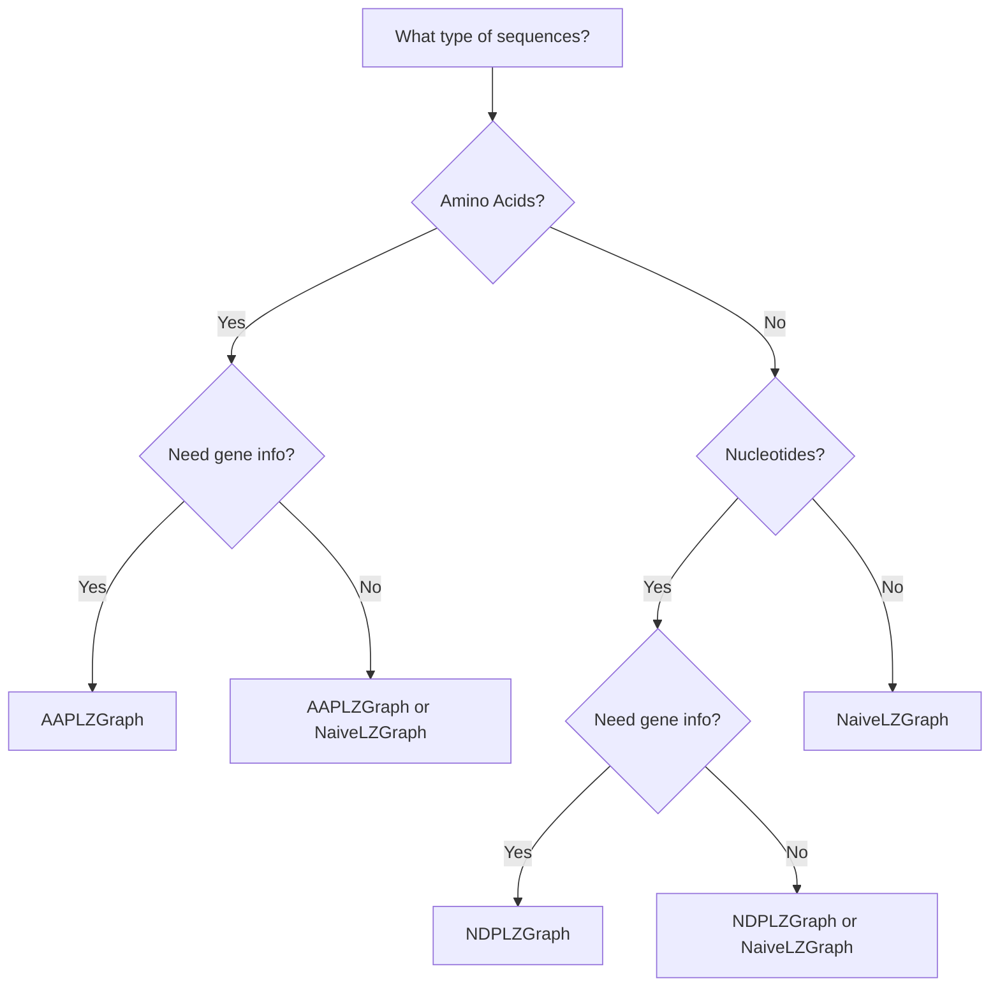

# First Steps

This guide helps you understand the fundamentals of LZGraphs and choose the right approach for your analysis.

## Understanding Your Data

LZGraphs works with CDR3 sequences from T-cell receptor repertoires. Your data should be in a pandas DataFrame with at minimum a sequence column.

### Required Input

| Graph Type | Input | Description |
|------------|-------|-------------|
| **AAPLZGraph** | DataFrame with `cdr3_amino_acid` column | Amino acid sequences |
| **NDPLZGraph** | DataFrame with `cdr3_rearrangement` column | Nucleotide sequences |
| **NaiveLZGraph** | List of strings + a dictionary | Any string sequences |

### Optional Columns

| Column | Purpose |
|--------|---------|
| `V` | V gene/allele annotation (e.g., `TRBV16-1*01`) |
| `J` | J gene/allele annotation (e.g., `TRBJ1-2*01`) |
| `abundance` | Clonotype count for abundance-weighted graph construction |

!!! tip "Abundance weighting"
    When an `abundance` column is present, edge and node statistics are weighted by
    clonotype count, so the graph reflects the expanded state of the repertoire rather
    than treating every unique sequence equally.

## Choosing the Right Graph Type

LZGraphs provides three graph types, each optimized for different use cases:



### AAPLZGraph (Amino Acid Positional)

**Best for:** Amino acid CDR3 sequences with positional information

```python
from LZGraphs import AAPLZGraph

graph = AAPLZGraph(data)  # data has 'cdr3_amino_acid' column
```

**Features:**
- Position-aware encoding (e.g., `C_1`, `A_2`, `S_3`)
- V/J gene annotation support
- Compact graphs for amino acid alphabets
- Ideal for most TCR analysis tasks

### NDPLZGraph (Nucleotide Reading Frame Positional)

**Best for:** Nucleotide CDR3 sequences with fine-grained positional information

```python
from LZGraphs import NDPLZGraph

graph = NDPLZGraph(data)  # data has 'cdr3_rearrangement' column
```

**Features:**
- Double position encoding for higher resolution
- V/J gene annotation support
- Better for sequence-level analysis
- Larger graphs than AAPLZGraph

### NaiveLZGraph

**Best for:** Custom dictionaries, cross-repertoire comparisons, or machine learning features

```python
from LZGraphs import NaiveLZGraph
from LZGraphs.utilities import generate_kmer_dictionary

# Create a fixed dictionary for consistent feature vectors
dictionary = generate_kmer_dictionary(6)

# Build graph with fixed dictionary
graph = NaiveLZGraph(sequences, dictionary)
```

**Features:**
- Fixed dictionary across all repertoires
- Consistent feature dimensions for ML
- No positional encoding (simpler graphs)
- Useful for eigenvector centrality features

## Quick Comparison

| Feature | AAPLZGraph | NDPLZGraph | NaiveLZGraph |
|---------|------------|------------|--------------|
| Input | Amino acids | Nucleotides | Any strings |
| Position encoding | Single | Double | None |
| V/J gene support | Yes | Yes | No |
| Graph size | Medium | Large | Configurable |
| Best for | Most TCR analysis | Nucleotide-level | ML features |

## Input Data Format

### Example: AAPLZGraph Data

```python
import pandas as pd

data = pd.DataFrame({
    'cdr3_amino_acid': [
        'CASSLEPSGGTDTQYF',
        'CASSDTSGGTDTQYF',
        'CASSLEPQTFTDTFFF',
        'CASSLGQGSTEAFF'
    ],
    'V': [
        'TRBV16-1*01',
        'TRBV1-1*01',
        'TRBV16-1*01',
        'TRBV5-1*01'
    ],
    'J': [
        'TRBJ1-2*01',
        'TRBJ1-5*01',
        'TRBJ2-7*01',
        'TRBJ1-1*01'
    ]
})
```

### Example: NDPLZGraph Data

```python
data = pd.DataFrame({
    'cdr3_rearrangement': [
        'TGTGCCAGCAGTTTAGAGCCCAGCGGGGGG...',
        'TGTGCCAGCAGTGACACTTCAGGGGGGACT...',
    ],
    'V': ['TRBV16-1*01', 'TRBV1-1*01'],
    'J': ['TRBJ1-2*01', 'TRBJ1-5*01']
})
```

## Understanding Graph Nodes

Each graph type encodes sequences differently:

### AAPLZGraph Encoding

```python
from LZGraphs import AAPLZGraph

sequence = "CASSLGQ"
encoded = AAPLZGraph.encode_sequence(sequence)
print(encoded)
# ['C_1', 'A_2', 'S_3', 'SL_5', 'G_6', 'Q_7']
```

The `_N` suffix indicates the position in the sequence.

### NDPLZGraph Encoding

```python
from LZGraphs import NDPLZGraph

sequence = "TGTGCC"
encoded = NDPLZGraph.encode_sequence(sequence)
print(encoded)
# ['T0_1', 'G1_2', 'TG2_4', 'C1_5', 'C2_6']
```

Each node has the format `{subpattern}{reading_frame}_{position}`, where the reading frame
(0, 1, or 2) indicates the codon position and the suffix is the cumulative sequence position.

### NaiveLZGraph Encoding

```python
from LZGraphs.utilities import lempel_ziv_decomposition

sequence = "TGTGCC"
encoded = lempel_ziv_decomposition(sequence)
print(encoded)
# ['T', 'G', 'TG', 'C', 'C']
```

No positional information, pure LZ76 decomposition.

## Next Steps

Now that you understand the basics:

1. **[Graph Construction Tutorial](../tutorials/graph-construction.md)** - Build graphs with different options
2. **[Concepts: LZ76 Algorithm](../concepts/lz76-algorithm.md)** - Understand how encoding works
3. **[Concepts: Graph Types](../concepts/graph-types.md)** - Deep dive into graph differences
