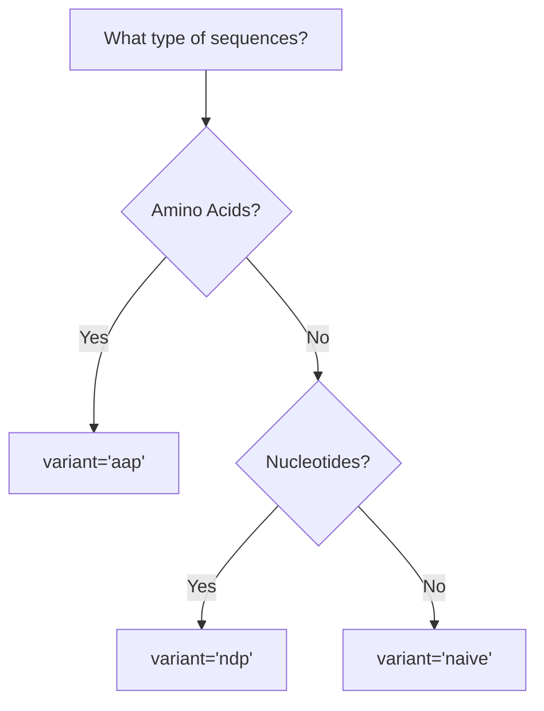

# First Steps

This guide helps you understand the fundamentals of LZGraphs and choose the right approach for your analysis.

## Understanding Your Data

LZGraphs works with CDR3 sequences from T-cell and B-cell receptor repertoires.

### Required Input

LZGraphs expects sequences as a plain `list[str]`.

| Graph Variant | Typical Input | Description |
|---------------|---------------|-------------|
| **'aap'** | Amino acid strings | Amino Acid Positional: position-aware encoding |
| **'ndp'** | Nucleotide strings | Nucleotide Double Positional: includes reading frame |
| **'naive'** | Any strings | Position-free: pure LZ76 subpatterns |

### Optional Data

| Argument | Purpose |
|----------|---------|
| `abundances` | List of counts to weight edges/nodes by clonotype frequency |
| `v_genes` | List of V gene annotations for gene-aware analysis |
| `j_genes` | List of J gene annotations for gene-aware analysis |

!!! tip "Abundance weighting"
    Providing `abundances` ensures the graph reflects the expanded state of the repertoire rather than treating every unique sequence equally.

## Choosing the Right Graph Variant

One unified `LZGraph` class handles all three variants:


```mermaid
flowchart TD
    A[What type of sequences?] --> B{Amino Acids?}
    B -->|Yes| E[variant='aap']
    B -->|No| D{Nucleotides?}
    D -->|Yes| I[variant='ndp']
    D -->|No| J[variant='naive']
```

### AAP Variant (Amino Acid Positional)

**Best for:** Most TCR/BCR analysis tasks using amino acid sequences.

```python
from LZGraphs import LZGraph
graph = LZGraph(sequences, variant='aap')
```

- **Encoding:** Position-aware labels like `C_2`, `A_3`, `S_4` (position 1 is the internal start sentinel).
- **Use case:** Comparing repertoires, calculating PGEN, diversity analysis.

### NDP Variant (Nucleotide Double Positional)

**Best for:** Fine-grained nucleotide-level analysis.

```python
graph = LZGraph(sequences, variant='ndp')
```

- **Encoding:** Includes reading frame and position, e.g., `T0_1`, `G1_2`.
- **Use case:** Studying somatic hypermutation or nucleotide-level generation biases.

### Naive Variant (Position-free)

**Best for:** General sequence analysis where position is less critical.

```python
graph = LZGraph(sequences, variant='naive')
```

- **Encoding:** Pure LZ76 subpatterns without position info, e.g., `C`, `A`, `SL`.
- **Use case:** Motif discovery, simple sequence complexity metrics.

## Working with Repertoires

### Example: Building a Graph with Genes

```python
from LZGraphs import LZGraph

sequences = ['CASSLEPSGGTDTQYF', 'CASSDTSGGTDTQYF', 'CASSLEPQTFTDTFFF']
v_genes   = ['TRBV16-1*01', 'TRBV1-1*01', 'TRBV16-1*01']
j_genes   = ['TRBJ1-2*01', 'TRBJ1-5*01', 'TRBJ2-7*01']

graph = LZGraph(sequences, v_genes=v_genes, j_genes=j_genes, variant='aap')
```

### Projecting into Feature Space

Instead of using a fixed "k-mer dictionary", LZGraphs allows you to project any repertoire into the node space of a reference graph. This is ideal for machine learning pipelines.

```python
# Build a reference graph (e.g., from a large healthy cohort)
reference_graph = LZGraph(healthy_sequences, variant='aap')

# Project a new sample into this space
# Returns a numpy array of weights corresponding to the reference nodes
features = reference_graph.feature_aligned(LZGraph(new_sample_sequences))
```

## Understanding Node Labels

You can inspect how sequences are decomposed into graph nodes:

```python
from LZGraphs import lz76_decompose

print(lz76_decompose("CASSLEPSGGTDTQYF"))
# ['C', 'A', 'S', 'SL', 'E', 'P', 'SG', 'G', 'T', 'D', 'TQ', 'Y', 'F']
```

In the graph, these tokens are augmented with positional information depending on the variant.

## Next Steps

1. **[Quick Start](quickstart.md)** - Get up and running in minutes
2. **[How-To: Data Preparation](../how-to/data-preparation.md)** - Learn how to clean and format your data
3. **[API Reference](../api/index.md)** - Detailed documentation of all classes and methods
