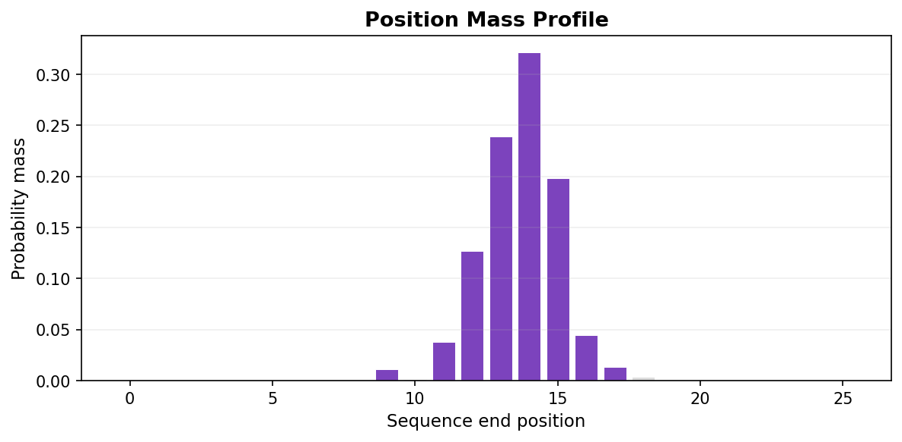

---
tags:
  - ML
  - Construction
---

# Feature Extraction for Machine Learning

LZGraphs provides three strategies for extracting fixed-size numerical feature vectors from repertoire graphs. These vectors can be fed directly into scikit-learn classifiers, neural networks, or any ML pipeline.

---

## The challenge

Immune repertoires have variable size — one sample might have 1,000 sequences, another 50,000. Standard ML algorithms need **fixed-dimensional** input. LZGraphs solves this by projecting repertoires into consistent feature spaces derived from the graph structure.

## Three strategies at a glance

| Strategy | Method | Dimension | Best for |
|----------|--------|-----------|----------|
| **A. Reference-aligned** | `ref.feature_aligned(query)` | `ref.n_nodes` | Cross-repertoire classification |
| **B. Mass profile** | `graph.feature_mass_profile()` | `max_pos + 1` (~31) | Length/position-based phenotyping |
| **C. Statistics** | `graph.feature_stats()` | 15 | Quick screening, low-dimensional |

---

## Strategy A: Reference-aligned features

This is the most powerful approach. You choose a **reference graph** (typically built from a large population or cohort), and then project every sample into the reference graph's node space.

### How it works

For each node in the reference graph, look up whether the same node exists in the query graph. If it does, record its frequency (outgoing traffic proportion). If not, record 0. The result is a vector whose dimension equals the reference graph's node count.

```python
from LZGraphs import LZGraph

# 1. Build a reference graph from a large cohort
ref = LZGraph(cohort_sequences, variant='aap')
print(f"Reference: {ref.n_nodes} nodes → {ref.n_nodes}-dim feature space")

# 2. Project individual samples into this space
features_patient_1 = ref.feature_aligned(LZGraph(patient_1_seqs, variant='aap'))
features_patient_2 = ref.feature_aligned(LZGraph(patient_2_seqs, variant='aap'))

print(f"Feature vector shape: {features_patient_1.shape}")
print(f"Non-zero features: {(features_patient_1 > 0).sum()}")
```

### Building a classification pipeline

```python
import numpy as np
from sklearn.ensemble import RandomForestClassifier
from sklearn.model_selection import cross_val_score

# Build reference from all training data combined
all_train_seqs = healthy_seqs + disease_seqs
ref = LZGraph(all_train_seqs, variant='aap')

# Extract features for each sample
X = []
y = []
for seqs, label in [(healthy_samples, 0), (disease_samples, 1)]:
    for sample_seqs in seqs:
        vec = ref.feature_aligned(LZGraph(sample_seqs, variant='aap'))
        X.append(vec)
        y.append(label)

X = np.array(X)
y = np.array(y)

# Train a classifier
clf = RandomForestClassifier(n_estimators=100, random_state=42)
scores = cross_val_score(clf, X, y, cv=5)
print(f"Accuracy: {scores.mean():.1%} +/- {scores.std():.1%}")
```

!!! tip "Choosing the reference graph"
    The reference graph defines the feature space. Using a **large, diverse cohort** as the reference ensures that most subpattern-position pairs are represented, giving you a rich feature space. If you use a small reference, many query nodes will map to zero.

### Properties of aligned features

- **Consistent dimension** across all samples (= reference node count)
- **Interpretable**: each feature corresponds to a specific subpattern at a specific position
- **Sparse**: most samples use only a fraction of the reference nodes
- **Normalized**: values sum to approximately 1.0 (frequency distribution)

---

## Strategy B: Mass profile

The mass profile distributes the graph's probability mass across sequence positions. It answers: **how much probability mass terminates at each position?**

```python
graph = LZGraph(sequences, variant='aap')

profile = graph.feature_mass_profile(max_pos=30)
print(f"Shape: {profile.shape}")    # (31,)
print(f"Sum:   {profile.sum():.4f}")  # ~1.0
```

The result is a 31-element vector (positions 0 through 30) that forms a probability distribution. Peak positions correspond to the most common sequence lengths.

### Visualizing the mass profile

```python
import matplotlib.pyplot as plt

fig, ax = plt.subplots(figsize=(8, 4))
ax.bar(range(len(profile)), profile, color='#42A5F5')
ax.set_xlabel("Sequence position")
ax.set_ylabel("Probability mass")
ax.set_title("Mass Profile")
plt.tight_layout()
plt.show()
```

<figure markdown="span">
  { width="85%" }
  <figcaption>Mass profile for a 5,000-sequence repertoire. Each bar shows how much probability mass terminates at that position. The peak at position 13 reflects the most common CDR3 length. This 31-element vector is a compact, fixed-size fingerprint of the repertoire's length-position structure.</figcaption>
</figure>

### Use case: comparing length-position distributions

The mass profile captures differences in CDR3 length distribution and how probability mass is distributed across positions. Two repertoires with different V-gene usage will have different mass profiles even if their overall diversity is similar.

```python
profile_a = graph_a.feature_mass_profile()
profile_b = graph_b.feature_mass_profile()

# Cosine similarity between profiles
from numpy.linalg import norm
cos_sim = np.dot(profile_a, profile_b) / (norm(profile_a) * norm(profile_b))
print(f"Profile similarity: {cos_sim:.4f}")
```

---

## Strategy C: Graph statistics vector

The fastest and simplest approach — a 15-element vector of scalar statistics computed from the graph:

```python
graph = LZGraph(sequences, variant='aap')
stats = graph.feature_stats()
print(f"Shape: {stats.shape}")  # (15,)
```

### What's in the vector

| Index | Feature | Description |
|:---:|:---|:---|
| 0 | `n_nodes` | Total nodes in the graph |
| 1 | `n_edges` | Total edges |
| 2 | `n_root` | Number of root nodes (always 1) |
| 3 | `n_sinks` | Number of terminal ($) nodes |
| 4 | `D(0)` | Hill number at order 0 (richness) |
| 5 | `D(0.5)` | Hill number at order 0.5 |
| 6 | `D(1)` | Hill number at order 1 (effective diversity) |
| 7 | `D(2)` | Hill number at order 2 (inverse Simpson) |
| 8 | `D(5)` | Hill number at order 5 |
| 9 | `H` | Shannon entropy (nats) |
| 10 | `DR` | Dynamic range (orders of magnitude) |
| 11 | `n_sinks` | Terminal node count (same as index 3; reserved for future use) |
| 12 | `sink_frac` | Fraction of nodes that are terminals |
| 13 | `max_out` | Maximum out-degree |
| 14 | `uniformity` | Entropy uniformity (0 to 1) |

### Use case: quick cohort screening

When you have many samples and need a fast initial comparison:

```python
import numpy as np

# Extract stats for all samples
all_stats = np.array([
    LZGraph(sample_seqs, variant='aap').feature_stats()
    for sample_seqs in all_samples
])

print(f"Feature matrix: {all_stats.shape}")  # (n_samples, 15)

# PCA for visualization
from sklearn.decomposition import PCA
pca = PCA(n_components=2)
coords = pca.fit_transform(all_stats)

# The 15 features capture diversity, complexity, and structural properties
# in a single low-dimensional representation
```

---

## Combining strategies

For maximum discriminative power, you can concatenate features from multiple strategies:

```python
import numpy as np

ref = LZGraph(cohort_seqs, variant='aap')

def extract_features(seqs):
    g = LZGraph(seqs, variant='aap')
    aligned = ref.feature_aligned(g)      # ~1500 features
    mass = g.feature_mass_profile()         # 31 features
    stats = g.feature_stats()               # 15 features
    return np.concatenate([aligned, mass, stats])

# Build feature matrix
X = np.array([extract_features(s) for s in all_samples])
print(f"Combined feature matrix: {X.shape}")
```

---

## Integration with scipy sparse

For very large reference graphs, the aligned feature vectors are sparse (most entries are zero). You can export the graph as a CSR matrix for efficient computation:

```python
from scipy.sparse import csr_matrix

csr = graph.adjacency_csr()
A = csr_matrix(
    (csr['weights'], csr['col_indices'], csr['row_offsets']),
    shape=(graph.n_nodes, graph.n_nodes),
)
print(f"Sparse adjacency: {A.shape}, nnz={A.nnz}")
```

---

## See Also

- [API: `feature_aligned()`](../api/lzgraph.md#feature_aligned) — method reference
- [API: `feature_stats()`](../api/lzgraph.md#feature_stats) — the 15-element vector
- [API: `adjacency_csr()`](../api/lzgraph.md#adjacency_csr) — scipy-compatible CSR export
- [Graph Construction tutorial](../tutorials/graph-construction.md) — building graphs for feature extraction
- [Compare Repertoires](repertoire-comparison.md) — non-ML comparison approaches
