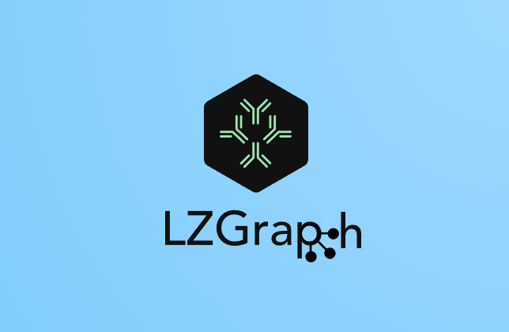

# Welcome to LZGraph Docs

Welcome to the official documentation for `LZGraph`, a Python library that provides a novel approach to encoding and analyzing the T-cell receptor beta chain (TCRB) repertoire using the Lempel-Ziv 76 algorithm. This library is based on the research presented in our recent paper (cite paper here). 

`LZGraph` is designed to integrate easily into any TCRB CDR3 analysis routine, providing important insights into attributes yet to be analyzed in an efficient and scalable manner. Unlike many other tools, our method relies on the sequence level alone, avoiding error-prone alignment steps or genotype reference that may not always be available when working with various species.

For quick plug-and-play tutorials showcasing the functionality provided by the LZGraph library, please visit our [Tutorials](tutorials.md) page.

The documentation is divided into several sections, each designed to help you utilize the functions and data structures implemented in this library in the most effective and efficient manner.

## Installation
To get started with LZGraph, you can install the library using pip:
  <pre><code>pip install LZGraphs</code></pre>

## Contact
For any questions, suggestions, or requests related to the library, please feel free to reach out:

Thomas Konstantinovsky - thomaskon90@gmail.com

We're excited to see how you will use LZGraph to contribute to the field of immunology and beyond!
