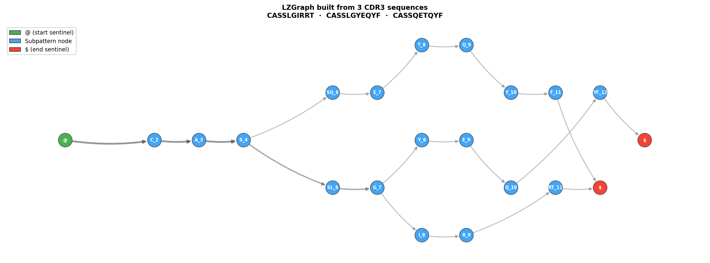

# LZGraphs

<div class="badges" markdown>
[](https://badge.fury.io/py/LZGraphs)
[](https://www.python.org/downloads/)
[](https://opensource.org/licenses/MIT)
</div>

**LZGraphs** is a high-performance Python library for analyzing immune receptor repertoires using Lempel-Ziv 76 compression graphs. Built on a C core, it transforms CDR3 sequences into probabilistic directed graphs that support exact probability computation, constrained sequence generation, and analytical diversity measurement — all without alignment or reference genotypes.

<figure markdown="span">
  { width="85%" }
  <figcaption>An LZGraph built from three CDR3 sequences. Shared prefixes form a single path; divergent suffixes branch. Edge weights encode transition probabilities.</figcaption>
</figure>

---

## Quick Start

```python
from LZGraphs import LZGraph

graph = LZGraph(['CASSLEPSGGTDTQYF', 'CASSDTSGGTDTQYF', 'CASSLEPQTFTDTFFF'],
                variant='aap')

graph.lzpgen('CASSLEPSGGTDTQYF')          # log generation probability
graph.simulate(1000, seed=42)              # generate new sequences
graph.hill_number(2)                       # inverse Simpson diversity
graph.predicted_richness(100_000)          # richness at sequencing depth
```

```bash
lzg build repertoire.tsv -o rep.lzg       # build from the command line
lzg diversity rep.lzg                      # diversity report
lzg simulate rep.lzg -n 10000 > synth.txt # generate sequences
```

[:material-download: Install](getting-started/installation.md){ .md-button .md-button--primary }
[:material-rocket-launch: Quick Start](getting-started/quickstart.md){ .md-button }

---

## What LZGraphs does

<div class="grid" markdown>

<div class="card" markdown>
### Score sequences
Compute the exact generation probability of any CDR3 under the repertoire model with `lzpgen()`.
</div>

<div class="card" markdown>
### Generate sequences
Simulate novel sequences via LZ-constrained random walks — with optional V/J gene constraints.
</div>

<div class="card" markdown>
### Measure diversity
Hill numbers, Shannon entropy, predicted richness, sample overlap, and sharing spectra — analytically from the graph.
</div>

<div class="card" markdown>
### Compare repertoires
Jensen-Shannon divergence, cross-scoring, and graph set operations (union, intersection, difference).
</div>

<div class="card" markdown>
### Extract ML features
Project repertoires into fixed-size feature vectors for classification, clustering, and regression.
</div>

<div class="card" markdown>
### Personalize models
Bayesian posterior updates to adapt a population graph to an individual patient.
</div>

</div>

---

## Documentation

<div class="quick-links" markdown>

[:material-shoe-print: **Learn**](getting-started/index.md)
Installation, quick start, tutorials, and worked examples.

[:material-wrench: **Guides**](how-to/index.md)
Task-oriented recipes: data prep, generation, comparison, ML features.

[:material-lightbulb: **Concepts**](concepts/index.md)
LZ76 algorithm, probability model, graph variants, distribution analytics.

[:material-api: **Reference**](api/index.md)
Complete API for `LZGraph`, `SimulationResult`, CLI tool, and exceptions.

</div>

---

<div class="grid" markdown>

<div class="card" markdown>
### :material-lightning-bolt: C Performance
Build graphs from 5,000 sequences in 80 ms. Simulate at ~5,000 seqs/sec. Save/load in < 1 ms.
</div>

<div class="card" markdown>
### :material-check-decagram: LZ76 Constraints
Every simulated sequence is a valid LZ76 decomposition. No biologically impossible outputs.
</div>

</div>

---

If you use LZGraphs in your research, please [cite our paper](resources/citation.md).
[:fontawesome-brands-github: GitHub](https://github.com/MuteJester/LZGraphs) · [:material-bug: Issues](https://github.com/MuteJester/LZGraphs/issues) · [:material-email: Contact](mailto:thomaskon90@gmail.com)
