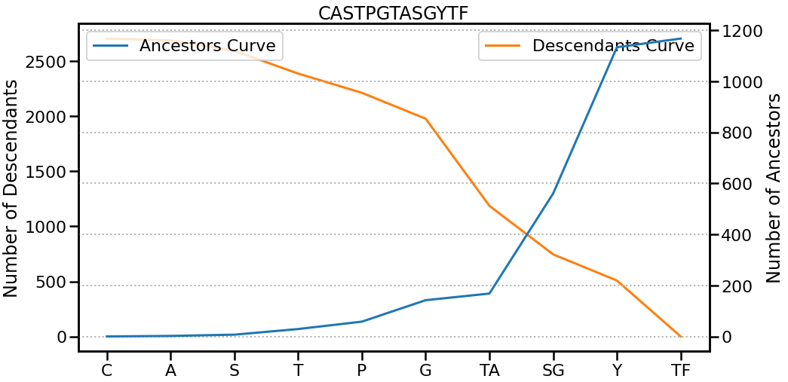
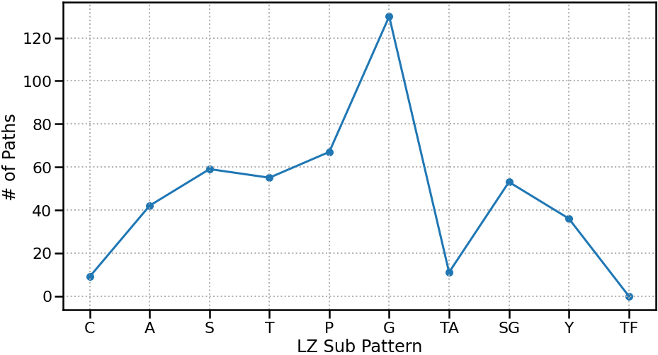
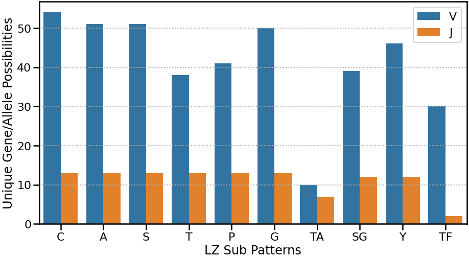
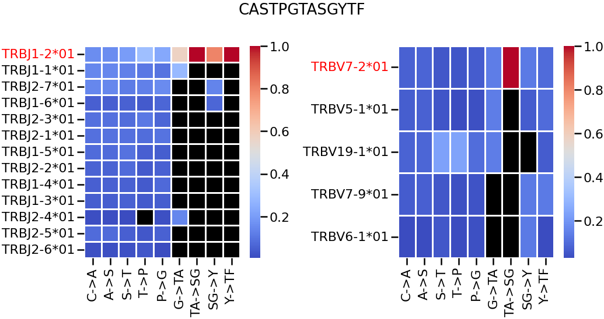

# Tutorials

This page provides detailed examples and instructions on how to effectively utilize LZGraphs in your work.

## Creating an LZGraph

The construction process for the Amino Acid Positional and Nucleotide Double Positional graphs follows a similar routine, while the Naive graph has slight differences.

### Constructing Amino Acid Positional and Nucleotide Double Positional Graphs

The example below demonstrates the construction of the Amino Acid Positional graph. The same steps can be applied to Nucleotide Double Positional Graphs.

Note:

- For Nucleotide Double Positional Graphs, the column corresponding to the sequence should be named "cdr3_rearrangement".
- For Amino Acid Positional Graphs, the column corresponding to the sequence should be named "cdr3_amino_acid".
- In both cases, V/J genes/alleles should be listed under the "V" column for V-related genes/alleles and under the "J" column for J-related genes/alleles.
- V/J genes/alleles are optional and are primary used for graph enrichment when generating sequences and deriving insight related to the genomic composition of a sequence.

```python 
from LZGraphs.AminoAcidPositional import AAPLZGraph
# from LZGraphs.NucleotideDoublePositional import NDPLZGraph 
import pandas as pd

data = pd.read_csv("/path/to/data/file.csv")
lzgraph = AAPLZGraph(data,verbose=True)
```
Verbose:
```markdown
Gene Information Loaded.. |  0.01  Seconds
Graph Constructed.. |  0.94  Seconds
Graph Metadata Derived.. |  0.94  Seconds
Individual Subpattern Empirical Probability Derived.. |  0.98  Seconds
Graph Edge Weight Normalized.. |  1.0  Seconds
Graph Edge Gene Weights Normalized.. |  1.13  Seconds
Terminal State Map Derived.. |  1.2  Seconds
Individual Subpattern Empirical Probability Derived.. |  1.37  Seconds
Terminal State Map Derived.. |  1.37  Seconds
LZGraph Created Successfully.. |  1.37  Seconds
==============================
```
The data file is a pandas DataFrame that includes the
sequences under a column named "cdr3_amino_acid".
Optionally, it can also have "V" and "J" columns containing 
relevant genomic information such as Gene/Family/Allele.
Any one of these columns can be used to create a graph, 
with functionality constrained by the genetic information on the edges.

Example of the input DataFrame:

| cdr3_amino_acid  | V           | J          |
|------------------|-------------|------------|
| CASSLEPSGGTDTQYF | TRBV16-1*01 | TRBJ1-2*01 |
| CASSDTSGGTDTQYF  | TRBV1-1*01  | TRBJ1-5*01 |
| CASSLEPQTFTDTFFF | TRBV16-1*01 | TRBJ2-7*01 |

### Constructing a Naive LZGraph

Below is an example of constructing a Naive LZGraph.
```python 
from LZGraphs.Naive import NaiveLZGraph,generate_dictionary
list_of_sequences = [ 'TGTGCCAGCAGGGCGGGATACGCAGTATTT',
                      'TGTGCCAGCAGCCAGCATCGTCGCAGTATTTT'
                      'TGTGCCAGCAGCCAGCAGGGCCGGGATACGCAGTATTTT'
                    ...]
                    
# generate all possible nodes with kmers up to length 6                 
dictionary = generate_dictionary(6) 
# construct a NaiveLZGraph from your list_of_sequences based on the generated dictionary
lzgraph = NaiveLZGraph(list_of_sequences, dictionary, verbose=True)
```
Note:

- The `generate_dictionary` function takes an integer `(X)` and generates all possible patterns that can be constructed from `(X)` nucleotides. For CDR3 sequences, we suggest using `X=6` as the maximum observed sub-pattern length in the CDR3 region is 6.
- The dictionary can be replaced with any number of sub-patterns if not all combinations are desired.
- The Naive LZGraph is most relevant in the context of nucleotides, as amino acid CDR3 sequences result in sparse graphs.

---

## Exploring Graph Attributes

After constructing an LZGraph, there are several attributes available to quickly infer repertoire statistical properties as well as explore the graph object itself, built above the networkx DiGraph class. Below are examples of how you can evaluate and explore those attributes.

### Amino Acid Positional and Nucleotide Double Positional Graphs

#### Exploring Graph Nodes and Edges

```python
# Retrieving the list of all graph nodes / edges
node_list = list(lzgraph.nodes)
edge_list = list(lzgraph.edges) 

print('First 10 Nodes: ',list(lzgraph.nodes)[:10])
print('First 10 Edges: ',list(lzgraph.edges)[:10])
```
Output:
```markdown
First 10 Nodes:  ['C_1', 'A_2', 'S_3', 'SQ_5', 'Q_6', 'G_7', 'R_8', 'D_9', 'T_10', 'QY_12']
First 10 Edges:  [('C_1', 'A_2'), ('C_1', 'T_2'), ('C_1', 'V_2'), ('C_1', 'S_2'), ('C_1', 'R_2'), ('C_1', 'G_2'), ('C_1', 'D_2'), ('C_1', 'F_2'), ('C_1', 'I_2'), ('A_2', 'S_3')]
```
#### Distribution of Observed Sequence Lengths:
After fitting an LZGraph to a repertoire you can quickly access the
distribution of different sequence lengths observed in the repertoire:

```python
print(lzgraph.lengths)
```
Output:
```python
{13: 2973, 15: 5075, 14: 4412, 16: 2862,
 12: 1147, 17: 1401, 19: 268, 22: 11, 20: 108,
 11: 508, 18: 655, 21: 38, 10: 72,
 24: 1, 9: 14, 7: 2, 4: 1,8: 1}
```
Note:
The key of the dictionary is an observed sequence length, the value corresponds to the
total number of sequences observed matching the key length.
#### Exploring Graph Initial and Terminal States:
 Initial state is defined as the first sub-pattern observed in a sequence,
 Terminal state is the last sub-pattern observed in a sequence, the lists and counts
 of all observed initial and final states are saved in every LZGraph and can be 
 accessed:
##### Getting all the initial states
```python
# Getting all the initial states
init_states = lzgraph.initial_states
print(init_states)
```
Output:
```python
C_1    19523
R_1       20
dtype: int64
```
##### Getting all the terminal states

```python
term_states = lzgraph.print(lzgraph.terminal_states)
print(term_states)
```
Output:
```python
F_13      2672
F_15      4490
F_14      3860
F_16      2502
F_12      1028
          ... 
G_9          1
AFF_12       1
FF_11        1
F_8          1
HF_22        1
Length: 86, dtype: int64
```
#### Graph V and J Marginal Distributions:
If V and J annotation were provided while constructing the graph,
the genetic data was embedded into each edge of the graph.
The marginal probability of each gene/allele can be observed by the following way:
```python
# print(lzgraph.marginal_vgenes)
print(lzgraph.marginal_jgenes)
```
Output:
```markdown
TRBJ1-2*01    0.159804
TRBJ1-1*01    0.143588
TRBJ2-7*01    0.141951
TRBJ2-1*01    0.090081
TRBJ2-3*01    0.088086
TRBJ1-5*01    0.076986
TRBJ2-5*01    0.075963
TRBJ2-2*01    0.057343
TRBJ1-4*01    0.050437
TRBJ1-6*01    0.047675
TRBJ1-3*01    0.043787
TRBJ2-6*01    0.015500
TRBJ2-4*01    0.008798
Name: J, dtype: float64
```

## Calculating the K1000 Diversity Index
As presented in the paper LZGraphs can offer the user a new diversity index (K1000).
The index value for any repertoire can be derived in the following way:

```python
import numpy as np
from LZGraphs.NodeEdgeSaturationProbe import NodeEdgeSaturationProbe

def get_k1000_diversity(list_of_sequences,lzgraph_encoding_function,draws=25):
    # sample 1000 unique sequences
    NESP = NodeEdgeSaturationProbe()
    result = NESP.resampling_test(list(set(list_of_sequences)),n_tests=draws,sample_size=1000)
    K_tests = [list(i.values())[-1]['nodes'] for i in result]
    return np.mean(K_tests)

list_of_seqs = data.cdr3_amino_acid.to_list() # this is the repertoire under inspection
k1000 = get_k1000_diversity(list_of_seqs,AAPLZGraph.encode_sequence) # this can be replace with AAPLZGraph.encode_sequence for amino acids
print('K1000 index for the given repertoire: ',k1000)
```
Output:
```markdown
K1000 index for the given repertoire:  217.64
```

Note:

* You can adjust the value of `draws` to be larger than 25, the higher the value is
  the more realizations will be generated for the K1000 index thus the returned
  mean value will be a better approximation.
* the encoding function can be replaced with any one of Naive/NDPLZGraph,AAPLZGraph
  encoding functions.

## Deriving Sequence Generation Probability (Pgen)
After an LZGraph is derived for a given repertoire, one can assess the generation
probability (Pgen) of a new sequence with respect to that repertoire (LZGraph).
```python
new_sequence = "CASRGERGDNEQFF"
# encode the sequence into relevant graph format
encoded_sequence = AAPLZGraph.encode_sequence(new_sequence)
#output
# ['C_1', 'A_2', 'S_3', 'R_4', 'G_5', 'E_6', 'RG_8', 'D_9', 'N_10', 'EQ_12', 'F_13', 'F_14']

pgen = lzgraph.walk_probability(encoded_sequence)
print(f'{new_sequence} Pgen: {pgen}')
```
Output:
```markdown
CASRGERGDNEQFF Pgen: 6.692834748776949e-13
```

## Generating New Sequences
An LZGraph constructed from a source repertoire can generate new sequences following
the statistical properties observed in the source.
Note that that if V and J genes were provided the generation function will be testing
that the random sequence and their sub-pattern all are associated to initially random
V and J genes selected before generating the sequence.
```python
generated_walk,selected_v,selected_j = lzgraph.genomic_random_walk()
# replace genomic_random_walk with random_walk() if annotation was not provided
print(generated_walk,selected_v,selected_j)
```
Output:
```markdown
['C_1', 'S_2', 'A_3', 'T_4', 'G_5', 'GI_7', 'Q_8', 'Y_9', 'QE_11', 'TQ_13', 'YF_15'],
'TRBV29-1*01',
'TRBJ2-5*01'
```
You can transform the resulting walk back into a sequence by cleaning each node and
concatenating them into a single string.
Each LZGraph has a "clean_node" method that accompanies the relevant "encode_sequence"
method.
```python
clean_sequence = ''.join([AAPLZGraph.clean_node(node) for node in generated_walk])
# Note that AAPLZGraph needs to be replaced in case you used the NDPLZGraph
print(clean_sequence)
```
Output:
```markdown
CASSPGTGGTGELFF
```

## Feature Vector From Graph (Eigen Centrality)
One can derive a vector representation of an LZGraph in order to perform any
modeling task. The resulting vector in a sense capture the structural dynamics of 
a repertoire.
Note that the number of features in the resulting vector equal the number of nodes
in the graph, and the value in each node correspond to each node, so it is recommended
using the Naive LZGraph, this allows to create LZGraphs to different repertoires while
maintaining the same dictionary of sub-patterns (nodes).

```python
from LZGraphs.Naive import NaiveLZGraph,generate_dictionary
# Create a dictionary that will be shared between all repertoires
dictionary = generate_dictionary(6)
# create a graph, this can be done in a loop over many repertoires
lzgraph = NaiveLZGraph(list_of_sequences, dictionary, verbose=True)
# derive the feature vector
feature_vector = lzgraph.eigenvector_centrality()
print(pd.Series(feature_vector))
```
Output:
```markdown
A         3.009520e-01
T         1.183398e-01
G         1.186366e-01
C         2.461758e-01
AA        1.252643e-01
              ...     
CCCCGC    5.252576e-10
CCCCCA    5.252576e-10
CCCCCT    5.252576e-10
CCCCCG    5.252576e-10
CCCCCC    5.252576e-10
Length: 5460, dtype: float64
```

Note:
The `generate_dictionary` function given the value 6 return `5460` sub-patterns,
many of which may not exist in your graph, nonetheless this promises that all
the repertoires encoded will produce the same feature vector dimension but the
value across the different sub-pattern will be different.

## Plotting Graph Related Features
The library provides multiple plots that can be useful when analyzing sequence
and comparing between sequences.
### Ancestors Descendants Curves Plot
In this chart you can examine at each sub-pattern of a given sequence
the amount descendants nodes reachable at each node contained in your sequence,
as well as the amount of ancestors at each node.
Sequence with different attribute differ both by the slope and the convergence
rate of these curve as well as by the intersection point between the curves.
```python
from LZGraphs.Visualize import ancestors_descendants_curves_plot
sequence = 'CASTPGTASGYTF'
ancestors_descendants_curves_plot(lzgraph,sequence)
```
Output:

### Sequence Possible Paths Plot
In this chart we look at a reduced and immediate version of Descendants curve.
For each sub-pattern derived from a given sequence and based on an LZGraph,
We can examine the number of alternatives there are at each node, this indicates
the rarity of a sequence and is correlated with the difference from the 
mean Levenshtein distance of the repertoire as shown in the LZGraphs paper.
```python
from LZGraphs.Visualize import sequence_possible_paths_plot
sequence = 'CASTPGTASGYTF'
sequence_possible_paths_plot(lzgraph,sequence)
```
Output:


### Node Genomic Variability Plot
In this chart we look at the number of V and J genes/alleles per node in a given sequence with respect
to a given repertoire.
Not only can one infer the sub-patterns in a sequence that have the exceptional number of V and J alternatives
but also when comparing between the same sequence in different repertoires (different LZGraphs) one can infer
the amount difference at each sub-pattern between the two repertoires.
```python
from LZGraphs.Visualize import sequence_genomic_node_variability_plot
sequence = 'CASTPGTASGYTF'
sequence_genomic_node_variability_plot(lzgraph,sequence)
```
Output:



### Edge Genomic Variability Plot
In this chart we look at the number of V and J genes/alleles per edge in a given sequence with respect
to a given repertoire.

* Allele/gene names colored in red signify that the allele/gene appeared in all the edges in the given sequence.
* Black cells signify that this spesific allele/gene wasnt observed at that edge.
* The color gradient at each cell represents the probability of choosing that edge under the constraint of having
 that specific V/J.
```python
from LZGraphs.Visualize import sequence_genomic_edges_variability_plot
sequence = 'CASTPGTASGYTF'
sequence_genomic_edges_variability_plot(lzgraph,sequence)
```
Output:



## BOW Vectorizer
The library also provides a convenient class implementing the BOW logic presented in the paper.
Note that each instance of the BOW wrapper class has to fitted on a list of sequences (repertoire) before it
can transform new lists of sequences into BOW vectors.

```python
from LZGraphs.BOWEncoder import LZBOW
from LZGraphs.NucleotideDoublePositional import NDPLZGraph

sequence_list = data.cdr3_rearrangement.to_list()

# create vectorizer and choose the Nucleotide Double Positional (ndp) encdoing function (default is Naive)
vectorizer = LZBOW(encoding_function=NDPLZGraph.encode_sequence)

# fit on sequence list
vectorizer.fit(sequence_list)

# BOW dictionary
vectorizer.dictionary

bow_vector = vectorizer.transform(new_list_of_sequences)
```

