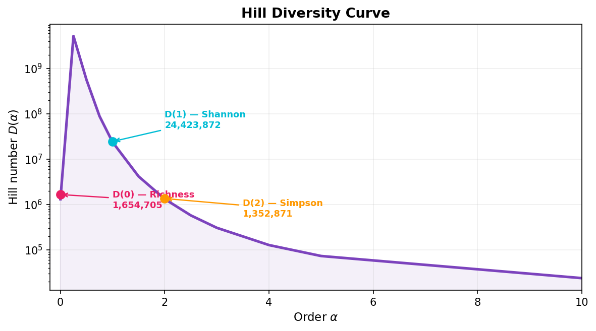
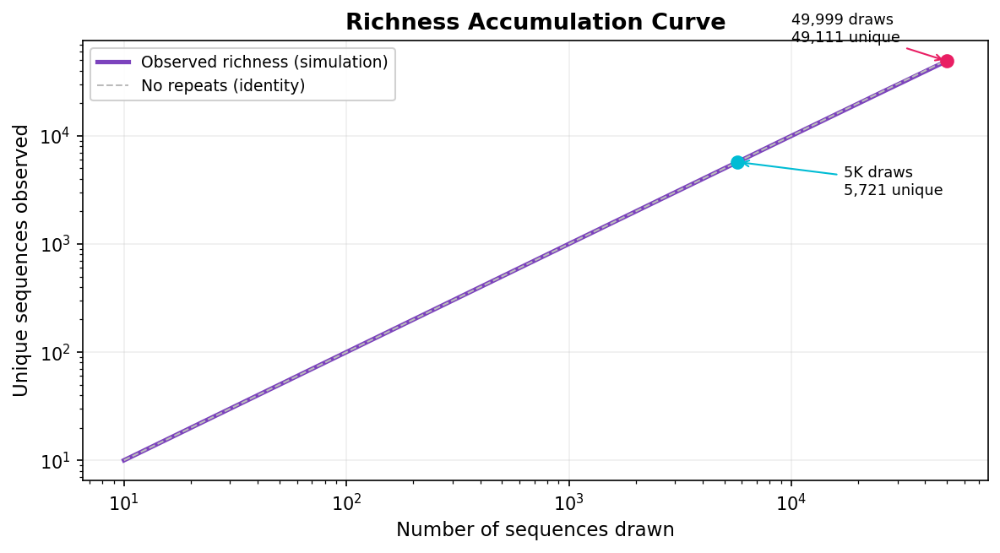
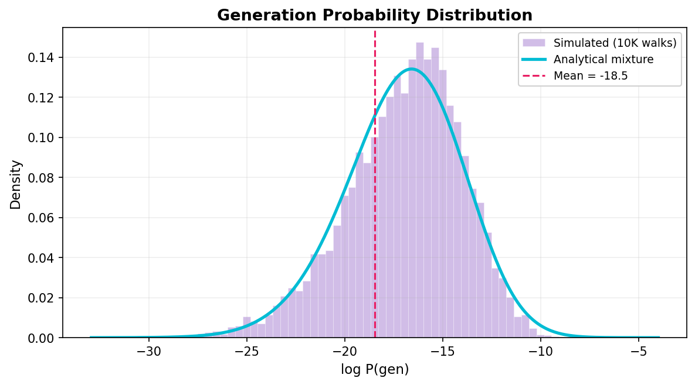

---
tags:
  - Diversity
  - Comparison
---

# Diversity Metrics

How diverse is an immune repertoire? This is one of the most fundamental questions in repertoire analysis, but it's deceptively hard to answer. "Diversity" means different things depending on what you care about — do you want to count how many *distinct* sequences exist? Or how *evenly distributed* they are? Or how many you'd *expect to see* if you sequenced deeper?

LZGraphs provides a unified framework for all of these questions. In this tutorial, we'll build intuition for each metric, understand what the numbers mean, and learn when to use which tool.

!!! tip "Prerequisites"
    You should be comfortable building graphs and scoring sequences. If not, start with [Graph Construction](graph-construction.md) and [Sequence Analysis](sequence-analysis.md).

---

## Setup

```python
import csv
import numpy as np
from LZGraphs import LZGraph, jensen_shannon_divergence, k_diversity

seqs = []
with open("examples/ExampleData3.csv") as f:
    for row in csv.DictReader(f):
        seqs.append(row['cdr3_amino_acid'])

graph = LZGraph(seqs, variant='aap')
print(f"Graph: {graph.n_nodes} nodes, {graph.n_edges} edges, from {graph.n_sequences} sequences")
```

---

## Hill numbers: the universal diversity measure

If you only learn one concept from this tutorial, make it **Hill numbers**. They unify all common diversity indices into a single framework with one parameter $\alpha$ that controls what aspect of diversity you're measuring.

### The intuition

Imagine a repertoire with 1,000 distinct sequences. If they're all equally likely (uniform distribution), the repertoire is very diverse. If 999 of them have tiny probability and one dominates, the repertoire is effectively monoclonal — even though 1,000 distinct sequences exist.

Hill numbers capture this distinction. The parameter $\alpha$ controls **how much you care about rare sequences**:

| $\alpha$ | Name | What it measures | Analogy |
|:---:|:---|:---|:---|
| 0 | **Richness** | How many distinct sequences can the graph produce? | Counting species in an ecosystem |
| 1 | **Shannon diversity** | What's the "effective" number of sequences, weighted by probability? | How many equally-likely species would give the same entropy? |
| 2 | **Simpson diversity** | What's the effective number if you focus on common sequences? | If you pick two random sequences, how likely are they different? |
| $\infty$ | **Berger-Parker** | How dominant is the most common sequence? | What fraction does the biggest clone take? |

As $\alpha$ increases, rare sequences matter less and less. The key property is **monotonicity**: $D(0) \geq D(1) \geq D(2) \geq \ldots$, always. If your repertoire has 10,000 producible sequences ($D(0) = 10{,}000$) but one clone dominates, $D(2)$ might be only 50.

### Computing Hill numbers

```python title="Computing the three key Hill numbers"
D0 = graph.hill_number(0)   # (1)
D1 = graph.hill_number(1)   # (2)
D2 = graph.hill_number(2)   # (3)

print(f"D(0) = {D0:,.0f}  (distinct sequences the graph can produce)")
print(f"D(1) = {D1:,.0f}  (effective diversity — accounting for probability)")
print(f"D(2) = {D2:,.0f}  (inverse Simpson — emphasizing common sequences)")
```

1. **D(0) = Richness.** Counts all producible sequences equally, regardless of probability. Estimated via Chao1 lower bound.
2. **D(1) = Shannon diversity.** The "effective number of sequences" — how many equally-likely sequences would give the same entropy. Computed as $e^H$.
3. **D(2) = Inverse Simpson.** Down-weights rare sequences. If you pick two random sequences, $1/D(2)$ is the probability they're identical.

**What do these numbers mean in practice?**

- If $D(0) \gg D(1)$, the repertoire has many possible sequences but most are very rare — a long tail distribution.
- If $D(1) \approx D(2)$, the distribution is relatively even across the common sequences.
- If $D(2)$ is very small compared to $D(0)$, a few sequences dominate while most contribute negligibly.

### Multiple orders at once

```python
orders = [0, 0.5, 1, 2, 5, 10]
values = graph.hill_numbers(orders)

for q, d in zip(orders, values):
    print(f"  D({q:4.1f}) = {d:>15,.1f}")
```

### The Hill curve

The **Hill curve** plots $D(\alpha)$ against $\alpha$ and gives a complete picture of the diversity profile. A steep drop means high inequality; a flat curve means evenness.

```python
import matplotlib.pyplot as plt

curve = graph.hill_curve()

fig, ax = plt.subplots(figsize=(8, 4))
ax.plot(curve['orders'], curve['values'], linewidth=2, color='#3F51B5')
ax.set_xlabel(r"Order $\alpha$", fontsize=12)
ax.set_ylabel(r"Hill number $D(\alpha)$", fontsize=12)
ax.set_yscale("log")
ax.set_title("Diversity Profile")
ax.grid(True, alpha=0.3)

# Mark key orders
for q, label in [(0, "Richness"), (1, "Shannon"), (2, "Simpson")]:
    d = graph.hill_number(q)
    ax.axhline(d, linestyle='--', alpha=0.3)
    ax.annotate(f"{label}\nD({q})={d:,.0f}",
                xy=(q, d), fontsize=9, ha='left')

plt.tight_layout()
plt.show()
```

<figure markdown="span">
  { width="90%" }
  <figcaption>Hill diversity curve for a 5,000-sequence repertoire. D(0) counts all producible sequences (richness); D(1) is the "effective" count weighted by probability (Shannon); D(2) emphasizes the dominant clones (Simpson). The steep drop from D(0) to D(2) reveals a long-tailed distribution — many rare sequences, few dominant ones.</figcaption>
</figure>

!!! info "How LZGraphs computes Hill numbers"
    LZGraphs uses **exact-probability importance sampling**: it simulates 10,000 walks through the graph, and each walk carries its exact log-probability from the transition model. This means even D(1) and D(2) are estimated accurately from a modest number of samples — because we know the *exact* probability of each sample, not just its empirical frequency. See [Distribution Analytics (concepts)](../concepts/distribution-analytics.md) for the mathematical details.

---

## Effective diversity and the diversity profile

The **effective diversity** is the Hill number at $\alpha = 1$ — also equal to $e^H$ where $H$ is the Shannon entropy. It answers a very intuitive question:

> *How many equally-likely sequences would produce the same amount of uncertainty?*

If the effective diversity is 100,000, the repertoire has the same entropy as a uniform distribution over 100,000 sequences — even if the actual number of producible sequences is much larger.

```python
d_eff = graph.effective_diversity()
print(f"Effective diversity: {d_eff:,.0f}")
```

For a richer summary:

```python
profile = graph.diversity_profile()

print(f"Shannon entropy:    {profile['entropy_nats']:.2f} nats")
print(f"                    {profile['entropy_bits']:.2f} bits")
print(f"Effective diversity: {profile['effective_diversity']:,.0f}")
print(f"Uniformity:         {profile['uniformity']:.4f}")
```

**Uniformity** is the ratio of observed entropy to the maximum possible entropy. A uniformity of 0.95 means the distribution is 95% as spread out as it could be; 0.01 would mean extreme concentration.

---

## Predicting richness: "what if I sequenced deeper?"

One of the most practical questions in repertoire analysis is: **how many unique sequences would I find if I sequenced to a different depth?**

LZGraphs answers this analytically using the **Poisson occupancy model**. Given the probability $p_i$ of each sequence, the expected number of unique sequences at depth $d$ is:

$$
F(d) = \sum_i \bigl(1 - (1 - p_i)^d\bigr)
$$

Each term is the probability that sequence $i$ appears at least once in $d$ draws.

```python
depths = [100, 1_000, 5_000]
for d in depths:
    r = graph.predicted_richness(d)
    print(f"  Depth {d:>7,d}  →  {r:>8,.0f} unique sequences")
```

!!! warning "Performance note"
    `predicted_richness()` uses Monte Carlo power-sum estimation with Wynn epsilon acceleration. For small graphs or moderate depths it's fast (< 1 second). For large graphs or very large depths (> 100K), computation can be slow. Use `richness_curve()` instead of calling `predicted_richness()` in a loop — it shares precomputed power sums across all depth points.

**Output (typical for a 5,000-sequence graph):**
```
  Depth      100  →       100 unique sequences
  Depth    1,000  →     1,000 unique sequences
  Depth     10,000  →      9,990 unique sequences
  Depth    100,000  →     93,426 unique sequences
  Depth  1,000,000  →    615,748 unique sequences
```

Notice the pattern: at low depths, almost every draw is unique (richness $\approx$ depth). As depth increases, you start seeing repeats, and richness grows more slowly. This **rarefaction curve** tells you whether your sequencing experiment has saturated the repertoire.

### Richness accumulation curve

Plot richness against depth to visualize saturation:

```python
import numpy as np
import matplotlib.pyplot as plt

depths = np.logspace(1, 7, 100)
richness = graph.richness_curve(depths)

fig, ax = plt.subplots(figsize=(8, 4))
ax.plot(depths, richness, linewidth=2, color='#3F51B5')
ax.plot(depths, depths, '--', color='gray', alpha=0.5, label='Perfect (no repeats)')
ax.set_xscale("log")
ax.set_yscale("log")
ax.set_xlabel("Sequencing depth")
ax.set_ylabel("Expected unique sequences")
ax.set_title("Richness Accumulation Curve")
ax.legend()
ax.grid(True, alpha=0.3)
plt.tight_layout()
plt.show()
```

<figure markdown="span">
  { width="90%" }
  <figcaption>Richness accumulation curve. At low depth, nearly every draw is unique (curve follows the identity line). As depth increases, repeats appear and richness grows sub-linearly. The gap between the curve and the identity line shows how much redundancy exists at each depth.</figcaption>
</figure>

!!! tip "Saturation check"
    If the curve levels off well before your actual sequencing depth, your experiment has captured most of the repertoire's observable diversity. If it's still climbing steeply, deeper sequencing would reveal substantially more unique sequences.

### Predicted overlap between samples

How many sequences would be **shared** between two independent samples from the same repertoire?

```python
overlap = graph.predicted_overlap(10_000, 50_000)
print(f"Expected shared sequences: {overlap:,.0f}")
```

This is useful for power analysis: before running an experiment, you can predict how much overlap to expect between replicates or between paired samples (e.g., blood vs. tissue from the same donor).

---

## Sharing spectrum: across many donors

If you model a population-level repertoire and want to predict how many sequences would be shared across a panel of donors, use `predict_sharing`:

```python
# 4 donors sequenced at different depths
draw_counts = [5_000, 8_000, 12_000, 6_000]
sharing = graph.predict_sharing(draw_counts)

print(f"Expected total unique across all donors: {sharing['expected_total']:,.0f}")
print(f"\nSharing spectrum:")
for k, count in enumerate(sharing['spectrum'][:6], 1):
    if count > 0.1:
        print(f"  Seen in exactly {k} donor(s): {count:,.0f} sequences")
```

The spectrum tells you how many sequences are "private" (in exactly 1 donor), "semi-public" (in 2-3 donors), and "highly public" (in all donors). This is computed analytically — no simulation needed.

---

## PGEN distribution analysis

The **PGEN distribution** characterizes the spread of generation probabilities across all producible sequences. It answers: are most sequences equally likely, or do some have much higher probability than others?

### Moments

```python
moments = graph.pgen_moments()
print(f"Mean log-Pgen:  {moments['mean']:.2f}")
print(f"Std log-Pgen:   {moments['std']:.2f}")
```

A larger standard deviation means the distribution is more spread out — some sequences are many orders of magnitude more likely than others.

### Dynamic range

How many orders of magnitude does the probability span from the rarest to the most common sequence?

```python
dr = graph.pgen_dynamic_range()
print(f"Dynamic range: {dr:.1f} orders of magnitude")

detail = graph.pgen_dynamic_range_detail()
print(f"Most probable:  log P = {detail['max_log_prob']:.2f}")
print(f"Least probable: log P = {detail['min_log_prob']:.2f}")
```

A dynamic range of 10 orders means the most common sequence is $10^{10}$ times more likely than the rarest — an enormous spread that's typical of real immune repertoires.

### The analytical distribution

<figure markdown="span">
  { width="90%" }
  <figcaption>Generation probability distribution for a 5,000-sequence repertoire. The purple histogram shows log-probabilities of 10,000 simulated sequences; the cyan curve is the analytical Gaussian mixture. The mean (~-21) means a typical sequence has probability $e^{-21} \approx 7 \times 10^{-10}$.</figcaption>
</figure>

For advanced analysis, you can get the full Gaussian mixture model fitted to the PGEN distribution:

```python
dist = graph.pgen_distribution()

print(f"Components: {dist.n_components}")
print(f"Mean: {dist.mean:.2f}")

# Sample from it
samples = dist.sample(10000, seed=42)
print(f"Sample mean: {samples.mean():.2f}")

# Evaluate PDF/CDF at specific points
x = np.linspace(-30, -5, 100)
pdf_values = dist.pdf(x)
```

### Diagnostics

Before trusting any of the above, check that the model forms a proper probability distribution:

```python
diag = graph.pgen_diagnostics()
print(f"Proper distribution: {diag['is_proper']}")
print(f"Total absorbed mass: {diag['total_absorbed']:.6f}")
```

If `is_proper` is `False`, the graph may be too small or have structural issues. See the [FAQ](../resources/faq.md) for troubleshooting.

---

## Comparing repertoires

### Jensen-Shannon Divergence

To measure how different two repertoires are, compute the JSD between their graphs. JSD is symmetric, bounded between 0 (identical) and 1 (maximally different):

```python
from LZGraphs import jensen_shannon_divergence

# Split the data to create two "repertoires"
graph_a = LZGraph(seqs[:2500], variant='aap')
graph_b = LZGraph(seqs[2500:], variant='aap')

jsd = jensen_shannon_divergence(graph_a, graph_b)
print(f"JSD: {jsd:.4f}")
```

**Interpreting JSD values:**

| JSD | Interpretation |
|:---:|:---|
| 0.00 - 0.05 | Nearly identical (technical replicates) |
| 0.05 - 0.15 | Very similar (same individual, different timepoints) |
| 0.15 - 0.30 | Moderately different (different healthy individuals) |
| 0.30 - 0.60 | Substantially different (disease vs. healthy) |
| 0.60 - 1.00 | Very different (different species or TCR chains) |

### K-diversity

K-diversity is a resampling-based measure: draw $k$ sequences, build a graph, count unique subpatterns, and repeat. The mean count characterizes the structural complexity at a fixed sample size:

```python
from LZGraphs import k_diversity

result = k_diversity(seqs, k=1000, variant='aap', draws=100)
print(f"K(1000) mean: {result['mean']:.1f}")
print(f"K(1000) std:  {result['std']:.2f}")
print(f"95% CI: [{result['ci_low']:.1f}, {result['ci_high']:.1f}]")
```

!!! tip "Choosing k"
    Pick $k$ well below your smallest repertoire size so all repertoires can be compared fairly. Common choices: 500, 1000, 5000.

---

## Putting it all together: a diversity report

Here's a complete diversity analysis you might run on a new repertoire:

```python
from LZGraphs import LZGraph

graph = LZGraph(seqs, variant='aap')

print("=" * 50)
print("DIVERSITY REPORT")
print("=" * 50)

# Hill numbers
print(f"\nHill Numbers:")
for alpha in [0, 1, 2, 5]:
    d = graph.hill_number(alpha)
    print(f"  D({alpha}) = {d:,.0f}")

# Diversity profile
prof = graph.diversity_profile()
print(f"\nShannon entropy: {prof['entropy_bits']:.1f} bits")
print(f"Uniformity: {prof['uniformity']:.4f}")

# PGEN distribution
moments = graph.pgen_moments()
print(f"\nPGEN distribution:")
print(f"  Mean log-Pgen: {moments['mean']:.2f}")
print(f"  Std log-Pgen:  {moments['std']:.2f}")
print(f"  Dynamic range: {graph.pgen_dynamic_range():.1f} orders of magnitude")

# Richness predictions
print(f"\nPredicted richness:")
for d in [1_000, 10_000, 100_000]:
    r = graph.predicted_richness(d)
    print(f"  At depth {d:>10,d}: {r:>10,.0f} unique sequences")

# Perplexity
ppl = graph.repertoire_perplexity(seqs[:500])
print(f"\nRepertoire perplexity: {ppl:.2f}")
```

---

## What we learned

- **Hill numbers** are the universal diversity framework — $\alpha$ controls the sensitivity to rare vs. common sequences, and $D(0) \geq D(1) \geq D(2)$ always holds
- **Effective diversity** ($D(1)$) answers "how many equally-likely sequences would have the same entropy?"
- **Richness curves** predict how many unique sequences you'd find at any sequencing depth — essential for saturation analysis and experiment planning
- **The PGEN distribution** characterizes the spread of generation probabilities — its dynamic range tells you how unequal the distribution is
- **JSD** measures divergence between two repertoires (0 = identical, 1 = maximally different)
- **Perplexity** measures model fit — lower means the sequences are more predictable under the model

## Next steps

- [**Distribution Analytics (concepts)**](../concepts/distribution-analytics.md) — the mathematical foundations behind these estimators
- [**Compare Repertoires (how-to)**](../how-to/repertoire-comparison.md) — recipes for pairwise and cohort comparisons
- [**Personalize Graphs**](../how-to/posterior-personalization.md) — Bayesian posterior updates for individual-level analysis
- [**API: LZGraph**](../api/lzgraph.md) — complete reference for all diversity methods
