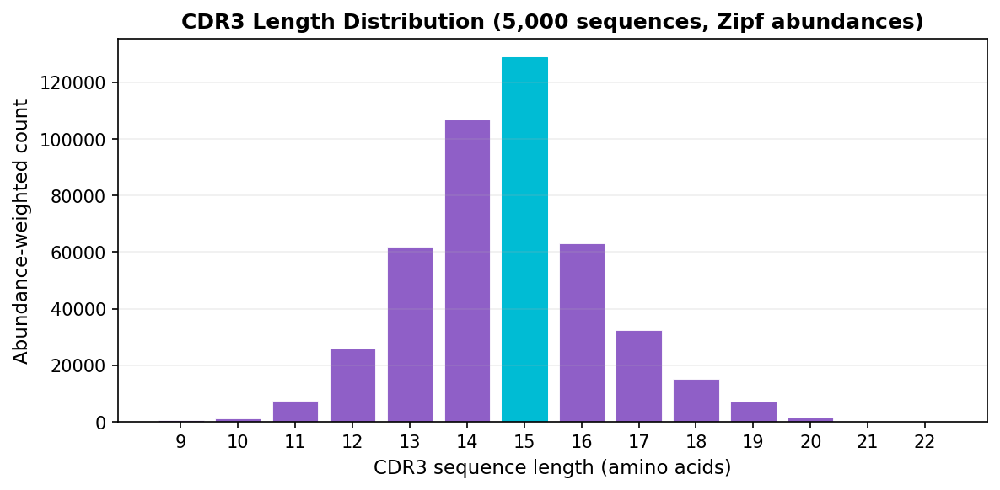

---
tags:
  - Construction
  - Genes
  - IO
---

# Graph Construction

In this tutorial you'll learn how LZGraphs transforms raw CDR3 sequences into a probabilistic directed graph — and why that's useful. By the end, you'll have a solid mental model of what the graph represents and how to inspect it.

---

## What does an LZGraph actually represent?

Imagine you have thousands of CDR3 sequences from a T-cell repertoire. Each sequence is a string of amino acids like `CASSLEPSGGTDTQYF`. LZGraphs compresses these sequences using the **Lempel-Ziv 76 algorithm** — the same family of algorithms behind `.zip` files — and uses the compression patterns to build a graph.

The key insight is that LZ76 decomposes a string into the **shortest novel subpatterns** at each position. For example:

```
CASSLEPSGGTDTQYF → C | A | S | SL | E | P | SG | G | T | D | TQ | Y | F
```

Each subpattern becomes a **node** in the graph, and the transitions between consecutive subpatterns become **edges**. When you process thousands of sequences, shared subpatterns create shared nodes — and the graph captures the entire repertoire's structure in a compact form.

Here's what a small LZGraph looks like — built from just three CDR3 sequences:

<figure markdown="span">
  { width="100%" }
  <figcaption>An LZGraph built from CASSLGIRRT, CASSLGYEQYF, and CASSQETQYF. The green node is the start sentinel (@), blue nodes are LZ76 subpatterns at specific positions, and red nodes are end sentinels ($). Notice how the shared <code>CASS</code> prefix is a single path that branches into different continuations.</figcaption>
</figure>

**Why is this useful?**

- The graph defines a **generative probability model**: you can compute the exact probability that the repertoire would produce any given sequence
- You can **simulate** new sequences that follow the repertoire's statistical patterns
- You can measure **diversity**, **richness**, and **complexity** analytically from the graph structure
- Two repertoires can be compared by comparing their graphs

---

## Building your first graph

Let's start with a small example so we can see exactly what's happening.

```python
from LZGraphs import LZGraph

# Six CDR3 amino acid sequences
sequences = [
    "CASSLGIRRT",
    "CASSLGYEQYF",
    "CASSLEPSGGTDTQYF",
    "CASSDTSGGTDTQYF",
    "CASSFGQGSYEQYF",
    "CASSQETQYF",
]

graph = LZGraph(sequences, variant='aap')
print(graph)
```

**Output:**
```
LZGraph(variant='aap', nodes=47, edges=49)
```

From just 6 sequences, LZGraphs built a graph with 47 nodes and 49 edges. That's because many subpatterns are shared across sequences — `C`, `A`, `S` appear at the start of every sequence, for instance — but at different positions and with different continuations.

### The `variant` parameter

The `variant` controls how subpatterns are labeled in the graph. There are three options:

=== "AAP (amino acid positional)"

    Each node encodes the subpattern **and** its position in the sequence. This is the most common choice for CDR3 analysis because position matters biologically — an `S` at position 3 (the conserved serine after CAS) has different meaning than an `S` at position 10 (in the junctional region).

    ```python
    graph = LZGraph(sequences, variant='aap')

    # Node labels look like: subpattern_position
    print(graph.nodes[:6])
    # ['C_2', 'A_3', 'S_4', 'SL_6', 'G_7', 'I_8']
    ```

    The `_N` suffix is the cumulative position in the original sequence.

=== "NDP (nucleotide double positional)"

    Designed for nucleotide sequences. Each node encodes the subpattern, its **reading frame** (codon position 0/1/2), and its position. Use this when you're working with CDR3 nucleotide sequences and want to preserve codon structure.

    ```python
    nt_sequences = [
        "TGTGCCAGCAGTTTAGA",
        "TGTGCCAGCAGTGACAC",
    ]
    graph = LZGraph(nt_sequences, variant='ndp')
    ```

=== "Naive (position-free)"

    No positional encoding — nodes are just the raw subpatterns. An `S` at position 3 and an `S` at position 10 are the **same node**. This creates smaller, more connected graphs, useful for motif discovery or when positional information isn't important.

    ```python
    graph = LZGraph(sequences, variant='naive')
    print(graph.nodes[:6])
    # ['C', 'A', 'S', 'SL', 'G', 'I']
    ```

!!! tip "Which variant should I use?"
    **Use `'aap'`** for most TCR/BCR analysis. It's the default and the best balance of expressiveness and compactness for amino acid CDR3 sequences. Use `'ndp'` only if you're working with nucleotide sequences. Use `'naive'` for cross-repertoire feature extraction or when you specifically want position-free analysis.

### Smoothing

By default, transition probabilities are maximum-likelihood estimates: $P(v \mid u) = \text{count}(u \to v) \;/\; \text{total outgoing}(u)$. If an edge was never observed, its probability is exactly zero — any sequence using that transition gets probability zero.

**Laplace smoothing** adds a small pseudocount $\alpha$ to every possible edge, preventing zero probabilities:

```python
# Without smoothing (default) — MLE estimates, zero for unseen transitions
graph = LZGraph(sequences, variant='aap')

# With smoothing — adds alpha to every edge count before normalizing
graph = LZGraph(sequences, variant='aap', smoothing=1.0)
```

| `smoothing` value | Effect |
|:---:|:---|
| `0.0` (default) | Pure MLE. Unseen transitions have probability 0. |
| `0.01 - 0.1` | Light smoothing. Unseen transitions get small but non-zero probability. |
| `1.0` | Standard Laplace smoothing. Good for small repertoires. |

Use smoothing when your repertoire is small and you want to avoid zero-probability dead ends during simulation. For large repertoires (1000+ sequences), smoothing usually isn't necessary.

---

## Exploring the graph structure

Now that we've built a graph, let's understand what's inside it.

### Size and shape

```python
print(f"Nodes:     {graph.n_nodes}")
print(f"Edges:     {graph.n_edges}")
print(f"Sequences: {graph.n_sequences}")
print(f"Density:   {graph.density:.4f}")
print(f"Is DAG:    {graph.is_dag}")
```

**Output:**
```
Nodes:     47
Edges:     49
Sequences: 6
Density:   0.0227
Is DAG:    True
```

The graph is always a **directed acyclic graph (DAG)** — edges only go forward (from earlier positions to later positions in the sequence). The density is low because most nodes only connect to a few successors, not to all other nodes.

### Nodes: the subpatterns

Each node represents a subpattern at a position. Let's look at them:

```python
print(f"Total nodes (excluding sentinels): {len(graph.nodes)}")
print(f"First 8: {graph.nodes[:8]}")
```

**Output:**
```
Total nodes (excluding sentinels): 41
First 8: ['C_2', 'A_3', 'S_4', 'SL_6', 'G_7', 'I_8', 'R_9', 'RT_11']
```

!!! info "Sentinel nodes"
    Internally, the graph has two special sentinel nodes: `@` (start) and `$` (end). Every walk starts at `@` and ends at a `$`-node. The `.nodes` property hides these, but you can see them with `.all_nodes` if you're curious about the internal representation.

### Edges: the transitions

Each edge represents an observed transition from one subpattern to the next, with a probability (weight) and a raw count:

```python
for src, dst, weight, count in graph.edges[:5]:
    print(f"  {src:8s} → {dst:8s}   P={weight:.3f}   count={count}")
```

**Output:**
```
  C_2      → A_3       P=1.000   count=6
  A_3      → S_4       P=1.000   count=6
  S_4      → SL_6      P=0.500   count=3
  S_4      → SD_6      P=0.167   count=1
  S_4      → SF_6      P=0.167   count=1
```

Notice that `C_2 → A_3` has weight 1.0 — every sequence starts with `C` then `A`, so there's no uncertainty there. But from `S_4`, the graph branches: half the sequences continue with `SL` (the `CASSL...` family), while others diverge to `SD`, `SF`, or `SQ`.

**This branching structure is exactly what makes the graph a generative model.** When you simulate a new sequence, the random walk follows these probabilities at each node.

### Following a path through the graph

You can trace the possible continuations from any node:

```python
# What can follow after "S_4"?
for label, weight, count in graph.successors("S_4"):
    print(f"  S_4 → {label:8s}  P={weight:.3f}  ({count}x)")
```

**Output:**
```
  S_4 → SL_6      P=0.500  (3x)
  S_4 → SD_6      P=0.167  (1x)
  S_4 → SF_6      P=0.167  (1x)
  S_4 → SQ_6      P=0.167  (1x)
```

This tells you that after the `CAS` prefix, 50% of the repertoire continues with `SL` (making `CASSL...`), while the other sequences branch into `CASSD...`, `CASSF...`, and `CASSQ...`.

### Length distribution

The graph remembers how many sequences were observed at each length:

```python
for length, count in sorted(graph.length_distribution.items()):
    bar = "#" * count
    print(f"  Length {length:2d}: {count} {bar}")
```

**Output:**
```
  Length 10: 2 ##
  Length 11: 1 #
  Length 14: 1 #
  Length 15: 1 #
  Length 16: 1 #
```

### Degree statistics

The **out-degree** of a node is how many different continuations it has. High out-degree means high uncertainty at that position — the repertoire is diverse there.

```python
import numpy as np

print(f"Max out-degree: {graph.max_out_degree}")
print(f"Max in-degree:  {graph.max_in_degree}")
print(f"Mean out-degree: {graph.out_degrees.mean():.1f}")
print(f"Nodes with out-degree > 2: {np.sum(graph.out_degrees > 2)}")
```

---

## Adding gene annotation

TCR sequences are produced by V(D)J recombination, and the V and J gene segments that were used heavily influence the sequence structure. If you have gene annotations, pass them during construction:

```python
sequences = ["CASSLGIRRT", "CASSLGYEQYF", "CASSLEPSGGTDTQYF"]
v_genes   = ["TRBV5-1*01", "TRBV5-1*01", "TRBV12-3*01"]
j_genes   = ["TRBJ1-1*01", "TRBJ2-7*01", "TRBJ1-1*01"]

graph = LZGraph(
    sequences,
    variant='aap',
    v_genes=v_genes,
    j_genes=j_genes,
)

print(f"Gene data available: {graph.has_gene_data}")
```

**Output:**
```
Gene data available: True
```

With gene data, you can inspect the marginal gene usage:

```python
print("V gene usage:")
for gene, freq in sorted(graph.v_marginals.items(), key=lambda x: -x[1]):
    print(f"  {gene}: {freq:.1%}")

print("\nJ gene usage:")
for gene, freq in sorted(graph.j_marginals.items(), key=lambda x: -x[1]):
    print(f"  {gene}: {freq:.1%}")
```

**Output:**
```
V gene usage:
  TRBV5-1*01: 66.7%
  TRBV12-3*01: 33.3%

J gene usage:
  TRBJ1-1*01: 66.7%
  TRBJ2-7*01: 33.3%
```

Gene data also enables **gene-constrained simulation** — generating sequences that use specific V/J combinations. We'll cover this in the [Sequence Analysis tutorial](sequence-analysis.md).

---

## Abundance weighting

By default, each sequence contributes equally to the graph regardless of how many times it was observed. In a real repertoire, some clonotypes are expanded (high count) and others are rare (count of 1). If you have abundance data, pass it to weight the graph:

```python
sequences  = ["CASSLEPSGGTDTQYF", "CASSDTSGGTDTQYF", "CASSQETQYF"]
abundances = [500, 12, 3]  # clonotype counts

graph = LZGraph(sequences, abundances=abundances, variant='aap')
```

**What changes with abundance weighting:**

- **Edge weights** reflect the abundance-weighted transition frequencies. An edge used by the dominant clone (count=500) will have much higher weight than one used by a rare clone (count=3).
- **Simulated sequences** will follow the expanded distribution — the dominant clone will appear ~97% of the time, matching the real repertoire.
- **Diversity metrics** will correctly reflect clonal dominance. Without weighting, all three clones look equally likely; with weighting, the repertoire appears low-diversity (dominated by one clone).

!!! tip "When to use abundance weighting"
    Use abundances when you want the graph to model the **observed repertoire** including clonal expansion. Omit them when you want to model the **unique sequence diversity** — treating each distinct sequence equally regardless of count.

---

## Saving and loading

Building a graph from thousands of sequences takes a few seconds. To avoid rebuilding every time, save it to disk in LZGraphs' binary format (`.lzg`):

```python
# Save
graph.save("my_repertoire.lzg")

# Load
loaded = LZGraph.load("my_repertoire.lzg")
print(loaded)
# LZGraph(variant='aap', nodes=47, edges=49)
```

The `.lzg` format preserves everything: graph structure, edge weights, gene data, and all metadata. It's compact and fast to load — typically 10-100x faster than rebuilding from sequences.

!!! info "File format"
    `.lzg` is a custom binary format with CRC-32C checksums for integrity verification. It is **not** a pickle file — it's safe to load `.lzg` files from untrusted sources. See [Save & Load Graphs](../how-to/serialization.md) for details.

---

## Working with larger datasets

Everything we've shown works the same way with real-sized datasets. Here's an example loading 5,000 sequences from a CSV file:

```python
import csv
from LZGraphs import LZGraph

seqs, v_genes, j_genes = [], [], []
with open("repertoire.csv") as f:
    for row in csv.DictReader(f):
        seqs.append(row['cdr3_amino_acid'])
        v_genes.append(row['v_call'])
        j_genes.append(row['j_call'])

graph = LZGraph(seqs, variant='aap', v_genes=v_genes, j_genes=j_genes)
print(graph)
# LZGraph(variant='aap', nodes=1721, edges=9644)
```

A graph from 5,000 sequences typically has 1,000-2,000 nodes and 5,000-15,000 edges, depending on the diversity of the repertoire. Construction takes under a second on modern hardware.

<figure markdown="span">
  { width="85%" }
  <figcaption>Length distribution of 5,000 CDR3 amino acid sequences. The mode (cyan) is at 15 amino acids — typical for human TRB CDR3. The graph's <code>length_distribution</code> property gives you this data as a dict.</figcaption>
</figure>

---

## What we learned

- An LZGraph is a **directed acyclic graph** where nodes are LZ76 subpatterns and edges are observed transitions
- The `variant` parameter controls the encoding: `'aap'` (amino acid + position), `'ndp'` (nucleotide + reading frame), or `'naive'` (no position)
- The graph structure — nodes, edges, weights — captures the entire repertoire's statistical patterns
- Gene annotations and abundance weighting add biological context to the model
- Graphs can be saved/loaded in the `.lzg` binary format

## Next steps

Now that you have a graph, you can:

- [**Score and simulate sequences**](sequence-analysis.md) — compute generation probabilities and generate novel sequences
- [**Measure diversity**](diversity-metrics.md) — Hill numbers, richness curves, and occupancy predictions
- [**Understand the probability model**](../concepts/probability-model.md) — the mathematics behind LZPGEN
- [**Explore graph variants in depth**](../concepts/graph-types.md) — how AAP, NDP, and Naive encodings differ
